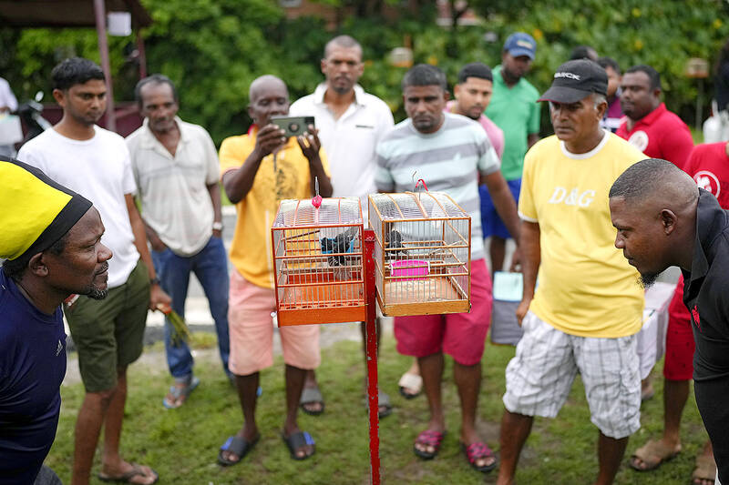
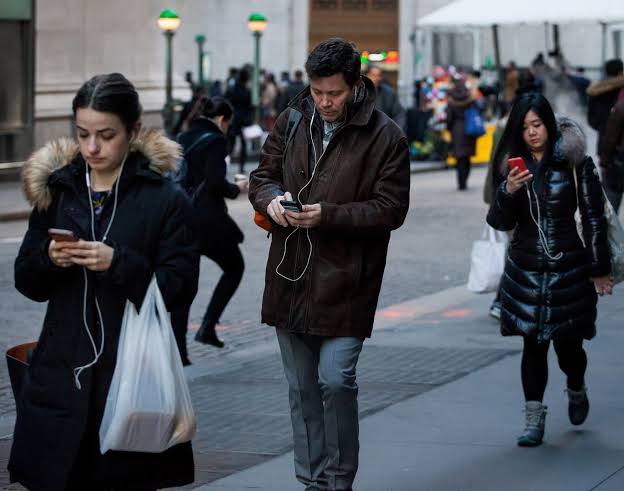
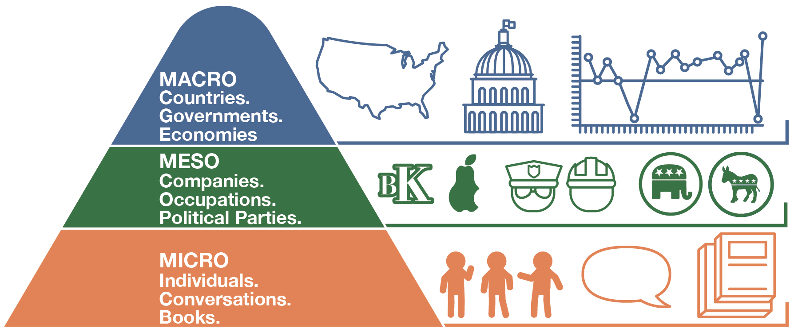
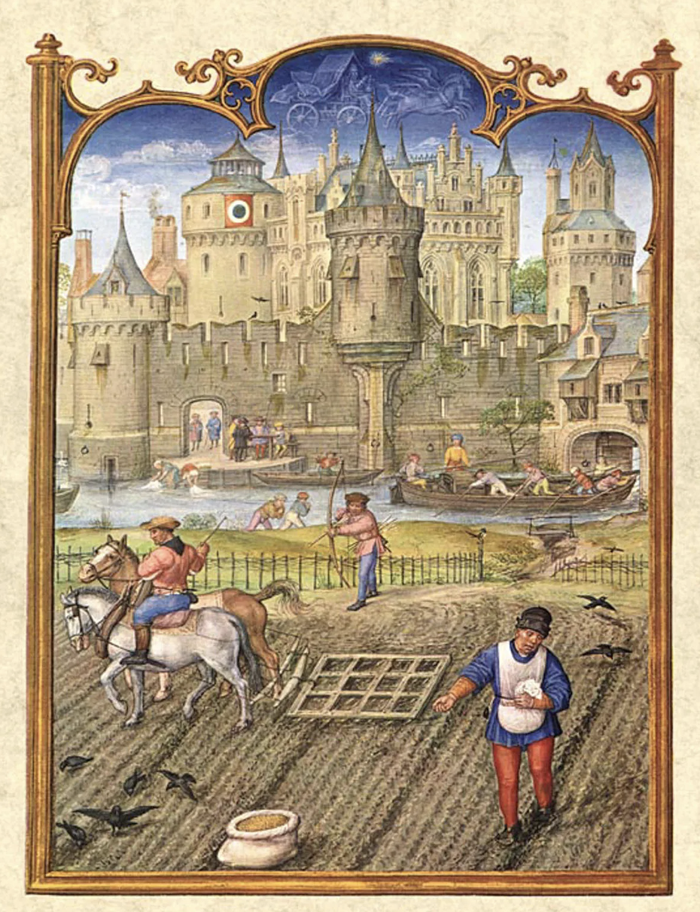
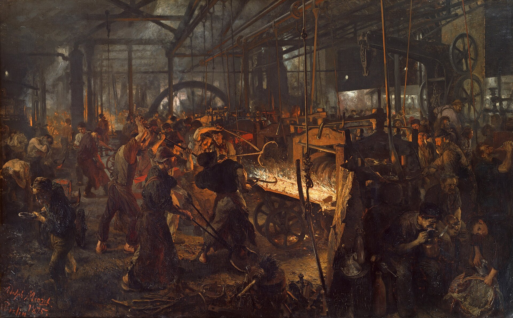
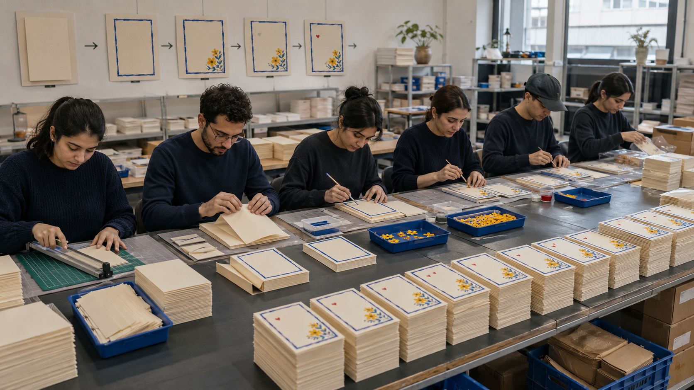
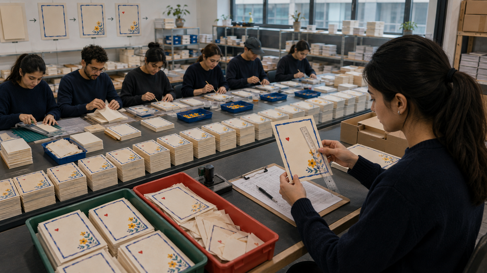
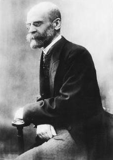
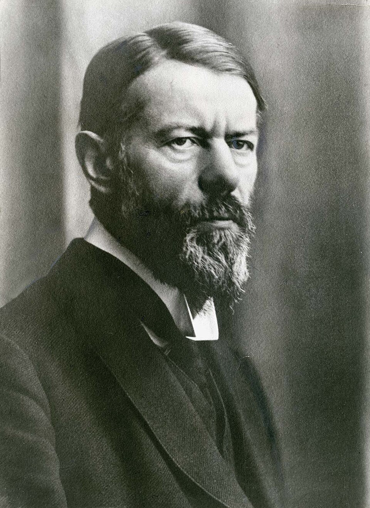

## What Is Sociology?

- **Sociology** — the scientific study of social behavior and human groups
- It focuses on social relationships and how they influence people's behavior
- And on how societies — the sum of those relationships — develop and change
- Scope: from peer pressure and friendship to suicide and global economic patterns

## The Sociological Imagination

- **Sociological imagination** — awareness of the relationship between an individual and the wider society (C. Wright Mills)
- Connects immediate personal settings to a broader social and historical context
- Requires viewing your own society **as an outsider would**

::: {.columns}
::: {.column width="50%"}
{fig-alt="Football players competing in a professional match." height=220}

::: {.small .center}
Football
:::
:::

::: {.column width="50%"}
{fig-alt="Spectators gathered around two caged finches during a speed-singing competition." height=220}

::: {.small .center}
Finch speed-singing
:::
:::
:::

## Two Habits of Mind

The sociological perspective is really two habits you can practice —

- **Seeing the general in the particular** — placing one person's behavior inside the wider pattern it belongs to
- **Seeing the strange in the familiar** — looking at your own everyday world as though you had arrived here yesterday

## Private Choices and Social Patterns

Three questions to hold onto:

- Why do students return to the **same seat** in a classroom, with no seating chart?
- Why do so many people marry someone with a **similar level of education**?
- Why does a baby name go suddenly **everywhere**, and then vanish?

<!-- ::: {.fragment .question-box} -->
<!-- Hands up: did you choose this seat — or did it choose you? -->
<!-- ::: -->

## Social Influence Reaches Private Choices

Picture yourself completely alone in your room, playing music, no one else in sight. Society is nowhere to be found.

::: {.fragment}
- Except: someone composed the song, and someone introduced you to it
:::

::: {.fragment}
- Every object in the room that you did not make yourself came from somewhere
:::

::: {.fragment}
- Even your *taste* has a history — what you heard as a child, what your friends play, where you grew up
:::

## The Phone Pattern: Individual Explanations

- Look around any public place — the mall, a family gathering, a restaurant. So many people are staring at their phones

::: {.fragment}
- First instinct: *"people are addicted"*, *"people are rude"* — these are individual-level explanations
:::

::: {.center}
{fig-alt="Several pedestrians looking at their phones while walking in a public place." height=230}
:::

## The Phone Pattern: Social Explanations

::: {.question-box}
What social conditions—not only personal choices—help produce this pattern?
:::

::: {.fragment}
- Apps are designed to hold attention
:::

::: {.fragment}
- Work and family obligations have moved onto the phone
:::

::: {.fragment}
- News and books have moved onto the phone
:::

::: {.fragment}
- A new social norm where being unreachable is seen as rude
:::

## Sociology as a Social Science

- **Science** — the body of knowledge obtained by methods based on systematic observation
- **Natural science** — the study of the physical features of nature and how they interact and change
- **Social science** — the study of the social features of humans and how they interact and change
<!-- - Climate change: economists price it, political scientists compare states — sociologists ask how individual actions are embedded in the workings of society -->

<!-- ## Sociology and Common Sense -->

<!-- Why do we trust some claims and not others? Quick trial — -->

<!-- - True or false: *women talk far more than men* -->

<!-- ::: {.fragment} -->
<!-- - False. Researchers put microphones on 396 students: both sexes spoke about **16,000 words a day** -->
<!-- ::: -->

<!-- - A flat earth was once "common sense" too — until Pythagoras and Aristotle questioned it -->
<!-- - The rule: nothing is accepted because "everyone knows it" — every claim gets tested -->

<!-- ::: {.takeaway} -->
<!-- Common sense only has to get us through the day. Sociology has to find out what is true. -->
<!-- ::: -->

## Four Levels of Analysis

::: {.smaller}
- **Microsociology** — stresses the study of small groups, often through experimental means
- **Mesosociology** — an intermediate level of analysis: formal organizations and social movements
- **Macrosociology** — concentrates on large-scale phenomena or entire civilizations
- **Global sociology** — makes comparisons among nations, using entire societies as units of analysis
:::

::: {.center}
{fig-alt="Pyramid illustrating micro, meso, and macro levels of social analysis." height=250}
:::

# The Founders {background-color="#1B2A4A"}

::: {.takeaway}
Durkheim, Weber, and Marx lived through the same period of upheaval. Each tried to understand a different part of it.
:::

## Industrialization and the Origins of Sociology {.smaller}

Sociology was not invented in a calm century. It was invented by people watching their world come apart.

- Factories multiply; cities swell faster than at any point in human history
- Kings fall; mass democracy and the nation-state arrive
- People leave villages where everyone knew them for cities where nobody does

::: {.smaller}
- **Auguste Comte** coins the word *sociology* — a science of behavior to repair a damaged society
- **Harriet Martineau** translates Comte, writes the first book on sociological methods, and argues that scholars must *act* on their convictions
- **Herbert Spencer** applies "survival of the fittest" to societies, and wants only to understand society, not improve it
:::

::: {.takeaway}
Every founder we meet is answering the same emergency with a different question.
:::

## Work in Feudal and Industrial Society {.smaller}

::: {.columns}
::: {.column width="50%"}
{fig-alt="Illuminated manuscript page showing peasants ploughing and pruning in fields below a walled castle." height=330}

::: {.small .center}
Peasants at work before the gates of a town. Miniature painting from the *Breviarium Grimani*, c. late 15th century.
:::
:::

::: {.column width="50%"}
{fig-alt="Industrial iron rolling mill crowded with workers operating heavy machinery around glowing metal." height=330}

::: {.small .center}
Adolph Menzel, *The Iron Rolling Mill (Modern Cyclopes)*, 1872–75 · Public domain
:::
:::
:::

::: {.small}
Roughly four centuries apart. Look at where the work happens, who is watching over it, and what is lighting the sky.
:::

## Durkheim, Weber, and Marx: Order, Meaning, and Power

- **Émile Durkheim** — What holds society together when traditional ties weaken?
- **Max Weber** — How can meanings shape action—and become organized into modern institutions?
- **Karl Marx** — Who owns productive resources, whose labor creates the result, and who controls the return?

::: {.takeaway}
Three starting points: **social order · meaning · power**
:::

## A Handmade Greeting Card {.smaller}

::: {.columns}
::: {.column width="50%"}
{fig-alt="A student at a paper-covered desk holding up the handmade card she has just finished." height=290}

::: {.small .center}
She chooses the paper, the border, the design... and she does every step
:::
:::

::: {.column width="50%"}
{fig-alt="A young woman sitting beside her mother, who is holding the handmade card and smiling." height=290}

::: {.small .center}
Her mother with the finished card
:::
:::
:::

::: {.fragment .question-box}
Her mother will keep this for years. Why? It is a folded piece of paper.
:::

## Division of Labor in the Card Workshop {.smaller}

::: {.columns}
::: {.column width="58%"}
{fig-alt="Six workers along a bench, each performing one step of the same greeting card, with the approved design pinned on the wall above them." height=310}
:::

::: {.column width="42%"}
The design sells. A workshop takes it on.

- Six people, six steps: **cut · fold · border · flowers · heart · pack**
- Nobody designs anything. The design is on the wall
- Output rises many times over
:::
:::

::: {.fragment .question-box}
Ask the woman who paints the flowers: *what did you make today?*
:::

## Ownership and Returns in the Card Workshop {.smaller}

::: {.columns}
::: {.column width="58%"}
{fig-alt="A manager at a desk overlooking the production line, with boxed stacks of finished cards beside him." height=310}
:::

::: {.column width="42%"}
- The six do the work
- Every finished card belongs to the workshop
- The wage is the same whether the line makes eighty cards or two hundred
- What is left over stays with the person who owns the workshop
:::
:::

::: {.fragment .question-box}
Nobody in that picture is cruel. So what is producing the difference?
:::

## Rules and Quality Control in the Card Workshop {.smaller}

::: {.columns}
::: {.column width="58%"}
{fig-alt="An inspector at the end of the line checking a finished card against a specification sheet, with a green accepted tray and a red rejected tray." height=310}
:::

::: {.column width="42%"}
Now every card must match the approved model.

- Border unbroken · fold within 3 mm · flowers in the corner
- Approved cards go in the green tray
- Rejected cards go in the red tray, and are not corrected
:::
:::

::: {.fragment .question-box}
The inspector did not design the card and cannot say why the rule is 3 mm. Why does her decision still count?
:::

## Comparing Four Forms of Card Production {.smaller}

Before we move on, compare what changed as the card moved from one person’s desk to the workshop.

::: {.columns}
::: {.column width="33%"}
::: {.small}
**The handmade card**

What did she have that the workshop does not?
:::
:::

::: {.column width="33%"}
::: {.small}
**The line**

What did the workshop gain? What did it cost?
:::
:::

::: {.column width="33%"}
::: {.small}
**The owner and the rulebook**

Nothing changed but the arrangement. Why does that change everything?
:::
:::
:::

::: {.takeaway}
Durkheim, Weber, and Marx will help us understand these changes in three different ways.
:::

# Durkheim {background-color="#1B2A4A"}

::: {.center}
{fig-alt="Portrait of Émile Durkheim." height=210}
:::

::: {.takeaway}
**The question:** how do people remain connected when society changes rapidly?
:::

::: {.small .center}
Émile Durkheim · 1858–1917 · Wikimedia Commons · Public domain
:::

## Durkheim: Behavior in Social Context {.smaller}

Durkheim's defining move was simple:

::: {.example-box}
Behavior must be understood within a **larger social context**, not only through individual motives or personality.
:::

He lived through rapid industrialization, urban growth, political upheaval, and weakening traditional ties.

::: {.takeaway}
His question: how do people remain connected when society changes rapidly?
:::

## Durkheim: Social Facts {.smaller}

**Social facts** are social patterns, rules, and institutions that:

- exist beyond any one person;
- are learned through group life;
- exert pressure on how people act.

Examples include greeting rules, school calendars, legal systems, language, currency, and suicide rates.

## Hospitality Norms as Social Facts {.smaller}

In many Kuwaiti homes, a guest is offered coffee, tea, or food almost as soon as they arrive. Offering nothing may be read as rude, even during a brief visit.

::: {.fragment style="font-size: 0.9em;"}
In some Dutch families, a child visiting a friend is expected to go home or wait in a different room when the family has dinner.
:::

::: {.fragment style="font-size: 0.9em;"}
To many Arabs, that sounds rude. The Dutch family may see it differently: dinner was planned for the household, and the child's family may be expecting them home.
:::

::: {.fragment style="font-size: 0.9em;"}
- No single host invented this expectation
- People learn it from family and community
- Approval and disapproval give it force
:::

::: {.question-box .fragment style="font-size: 0.9em;"}
What is another hosting or greeting rule that people know without seeing it written?
:::

::: {.takeaway .fragment}
A shared rule can feel like personal common sense because it has become part of a community's moral world.
:::

<!--
## Activity: Parable of the Polygons

::: {.board}
Optional extension · in pairs · **ncase.me/polygons**
:::

Small preferences can combine into a large pattern that nobody designed.

::: {.question-box}
Play to the end. Then answer: **who chose the final pattern?**
:::

## How Individual Preferences Produce Social Patterns

- No participant intended the divided pattern
- Repeated choices produced a structure that then limited later choices

::: {.takeaway}
This is a broader emergent-pattern mechanism. It illustrates how individual choices can create a social constraint; it is not direct evidence for every feature of Durkheim's social facts.
:::
-->

## From Private Acts to Social Patterns {.smaller}

Individual motives can vary. Sociology asks whether behavior also forms a pattern across groups or societies.

::: {.columns}
::: {.column width="48%"}
**Individual question**

Why did this person act?
:::

::: {.column width="52%"}
**Sociological question**

Why does the **rate** differ across social settings?
:::
:::

::: {.takeaway}
A stable difference in rates is a clue that social conditions may be involved.
:::

<!-- Canonical Slide 28, “Crime Is Normal,” is relocated to the deviance chapter. -->

## Durkheim's Comparison of Suicide Rates {.smaller}

Durkheim rejected untested explanations of suicide, such as inherited tendencies or cosmic forces.

He changed the question. Instead of asking why one person died, he compared **reported rates** across societies.

::: {.columns}
::: {.column width="55%"}
::: {.smaller}
| Country, 1869 | Reported suicides per million |
|---|---:|
| England | 67 |
| France | 135 |
| Denmark | 277 |
:::
:::

::: {.column width="45%"}
::: {.question-box}
What social differences could explain Denmark?
:::
:::
:::

## Durkheim: Social Integration and Suicide Rates {.smaller}

- Durkheim compared religious, marital, occupational, and national groups
- He concluded that suicide rates reflected the extent to which people were **integrated into group life**
- This was a claim about variation in **rates**, not a diagnosis of any individual

::: {.example-box}
**Theory** — a set of statements that seeks to explain problems, actions, or behavior
:::

::: {.takeaway}
A strong theory connects observations and gives researchers expectations they can test.
:::

## Specialization Creates Interdependence {.smaller}

Back to the card workshop:

- The handmade card maker could complete the whole product alone
- On the line, each person performed one specialized task
- Output rose, but nobody could complete a card without everyone else

::: {.takeaway}
The **division of labor** makes people different in their work and more dependent on one another.
:::

::: {.small}
Durkheim called cohesion through specialization **organic solidarity**. The technical contrast with mechanical solidarity is optional depth.
:::

<!-- Canonical Slide 32, “Ten Minutes Without Rules,” is removed from the route. -->

## Anomie: When Regulation Weakens {.smaller}

**Anomie** is the loss of direction that occurs when social regulation becomes ineffective, often during profound social change.

::: {.arrow-flow}
rapid change → familiar rules weaken → guidance becomes unclear → loss of direction
:::

- Anomie concerns weakened social guidance
- It is not a synonym for sadness, isolation, or Marx's alienation

::: {.takeaway}
Social change can expand possibilities while also weakening the rules people use to orient themselves.
:::

<!-- Canonical Slide 34, “Sociology in the Global Community: Influencers,” is relocated for possible later use. -->

## Durkheim: Intermediate Groups and Social Belonging {.smaller}

Durkheim proposed new groups between the family and the state that could provide belonging in large, impersonal societies.

- Occupational associations
- Unions
- Other groups that connect individuals to a wider community

::: {.takeaway}
Durkheim teaches us to look past an isolated individual and ask whether social ties, shared rules, and social conditions produce a measurable pattern.
:::

# Weber {background-color="#1B2A4A"}

::: {.center}
{fig-alt="Portrait of Max Weber in 1918." height=210}
:::

::: {.takeaway}
**The question:** how can sociology explain what actions mean—and what those meanings build?
:::

::: {.small .center}
Max Weber · 1864–1920 · Wikimedia Commons · Public domain
:::

## Weber: Social Action and Verstehen {.smaller}

- **Social action** — conduct to which people attach meaning and which takes account of others
- Measurement can reveal a pattern; explanation must also ask what the action *means* to the people acting
- **Verstehen** — learning the subjective meanings people attach to their actions. German for "understanding" or "insight"
- The same diwaniya attendance may mean friendship, family duty, networking, or political activity
- Interviews, observation, and context provide evidence; *verstehen* is not mind reading

::: {.example-box}
- **Durkheim:** What social pattern can we observe?
- **Weber:** What does the action mean to the actor—and what does that meaning help explain?
:::

<!-- ## Weber: Rationalization of Social Life {.smaller} -->
<!-- Relocated from the active route. Rationalization is introduced through the card-workshop case on Slides 42 and 46. -->

<!-- ## What Rationalization Looks Like {.smaller} -->
<!-- Relocated from the active route. The feature inventory is retained for future reference. -->

<!-- ## Weber: The Protestant Ethic and Economic Conduct {.smaller} -->
<!-- Relocated from the active route. The Protestant Ethic remains background reference, not a Chapter 1 learning target. -->

## Weber's Comparative Tool: The Ideal Type {.smaller}

An **ideal type** is a construct or model used to evaluate specific cases.

- It is a deliberately clear model, not a description of any one real case
- "Ideal" does **not** mean good, desirable, average, or perfect
- Its value lies in comparison: where does the real case fit, and where does it depart?

::: {.example-box}
Think of it as a ruler. A ruler is not a claim about how long things ought to be. It is only useful because it never varies.
:::

::: {.takeaway}
**Verstehen** investigates subjective meaning. An **ideal type** gives the investigation a consistent point of comparison.
:::

## Bureaucracy and the Ideal Type in the Card Workshop {.smaller}

::: {.columns}
::: {.column width="50%"}
**A clear bureaucratic model**

- A specialized role applies the standard
- Written rules and records guide decisions
- The same procedure applies to every card
:::

::: {.column width="50%"}
**The actual workshop**

- The inspector did not write the 3 mm rule
- Her decision counts because her role applies it
- The model lets us ask where practice fits—or departs
:::
:::

::: {.takeaway}
**Rationalization** organizes action through calculation, written rules, records, and specialized roles.
:::

<!-- ## Weber: Types of Legitimate Authority {.smaller} -->
<!-- Relocate to the government and power chapter: traditional, charismatic, and legal-rational authority. -->

<!-- ## What Is McDonaldization? {.smaller} -->

<!-- Sociologist **George Ritzer** built on Weber’s idea of rationalization. -->

<!-- **McDonaldization** is the process by which the logic of the fast-food restaurant comes to organize more and more areas of social life. -->

<!-- - **Efficiency** — reach the goal as quickly as possible -->
<!-- - **Calculability** — treat quantity as a measure of quality -->
<!-- - **Predictability** — produce the same experience every time -->
<!-- - **Control** — use scripts, technology, and fixed procedures to limit human variation -->

<!-- ::: {.example-box} -->
<!-- It is not really about hamburgers. It is about what happens when things like hospitals, airports, apps, and shops begin operating like fast-food systems. -->
<!-- ::: -->

<!-- ::: {.takeaway} -->
<!-- These systems promise speed, scale, and consistency—but what might they make us give up? -->
<!-- ::: -->

<!-- ## Activity: The McDonaldization Audit {.smaller} -->

<!-- ::: {.board} -->
<!-- Pick one familiar system or service -->
<!-- ::: -->

<!-- A fast-food counter · an IKEA visit · university registration · a delivery app · airport check-in · a hospital appointment system -->

<!-- Score it out of five on each — -->

<!-- - **Efficiency** — is it the fastest route from A to B? -->
<!-- - **Calculability** — does it count things, and treat the count as the point? -->
<!-- - **Predictability** — is it identical every time, everywhere? -->
<!-- - **Control** — are the humans in it following a script? -->

<!-- ::: {.question-box} -->
<!-- What does the system gain from each point you awarded? What does it lose? -->
<!-- ::: -->

## Rationalization and the Iron Cage in the Card Workshop {.smaller}

The workshop gains:

- **consistency** — every card is judged by the same standard
- **predictability** — workers know what will pass
- **coordination** — specialized roles can produce at scale

::: {.fragment}
The same arrangement narrows discretion: the inspector applies a rule she did not write, and the workers cannot correct a card in their own way.
:::

::: {.fragment .question-box}
Even if the 3 mm rule improves consistency, who is free to work differently?
:::

::: {.fragment .takeaway}
Rationalized systems increase predictability, but they also make people depend on rules that limit their autonomy. Weber called this constraint the **iron cage**.
:::

# Marx {background-color="#1B2A4A"}

::: {.center}
{fig-alt="Portrait of Karl Marx photographed by John Jabez Edwin Mayall." height=210}
:::

::: {.takeaway}
**Who owns productive resources, whose labor creates the result, and who controls the return?**
:::

::: {.small .center}
Karl Marx · 1818–1883 · John Mayall / Wikimedia Commons · Public domain
:::

## Marx and Engels: *The Communist Manifesto* {.smaller}

Marx did not present himself primarily as a sociologist. Sociology treats him as a major figure because his analysis of class, ownership, conflict, and institutional power shaped the field.

In 1848, Karl Marx and Friedrich Engels wrote a manifesto for the Communist League.

::: {.example-box}
“The history of all hitherto existing society is the history of class struggles.”
:::

::: {.fragment .takeaway}
- Marx and Engels argued that capitalist society divided owners and workers into classes with opposing interests
- The *Manifesto* urged the **proletariat**—workers whose principal resource was their labor—to unite and overthrow the capitalist class system
- Marx analyzed capitalism as a revolutionary socialist who wanted to replace it
:::

<!-- ## Marx: Class Struggle and Historical Change {.smaller} -->
<!-- Reference only. Historical materialism and the forces/relations-of-production taxonomy are not active Chapter 1 learning targets. -->

## Marx: Capitalism Divides Owners and Workers {.smaller}

::: {.columns}
::: {.column width="42%"}
{fig-alt="Painting of a crowded iron rolling mill with many workers each performing a different task around glowing metal." height=280}

::: {.small .center}
Adolph Menzel, *The Iron Rolling Mill*, 1875 · Public domain
:::
:::

::: {.column width="58%"}
- The **means of production** are the resources used to produce goods: factories, machinery, land, and capital
- The **bourgeoisie** owns and controls those resources and the products made with them
- The **proletariat** works for wages; its main resource is their labor
- These positions create conflicting interests over wages, conditions, output, control, and profit
:::
:::

::: {.takeaway}
Class is a social position within production—not a judgment about individual character.
:::

## Marx: Exploitation Is Built into the Relationship {.smaller}

::: {.example-box}
In the card workshop, the workers supplied the labor. The owner controlled the cards and the return from their sale.
:::

::: {.fragment}
- The workers' wages did not rise when output rose
- Ownership gave the owner control over the product and its return
- The positions therefore carried conflicting interests, even if everyone behaved kindly
:::

::: {.fragment .takeaway}
For Marx, **exploitation** is structural. Owners benefit from workers' labor because of how production is organized.
:::

## Marx: Alienation—Work Without Ownership or Control {.smaller}

**Alienation** occurs when the organization of work separates workers from ownership, control, connection, or creative activity.

::: {.columns}
::: {.column width="50%"}
**The handmade card**

- One maker chooses the design
- She controls the whole process
- The finished card is hers to give
:::

::: {.column width="50%"}
**The workshop line**

- Each worker repeats one assigned task
- No worker controls or completes the whole card
- The finished cards belong to the workshop
:::
:::

::: {.fragment .takeaway}
Marx's alienation concerns the organization and ownership of work—not a general feeling of unhappiness.
:::

## Marx: Class Power Extends Beyond the Factory {.smaller}

Marx described a system of **economic, social, and political relationships** that maintained owners' power over workers.

- Ownership provides control over productive resources and the products of labor
- Institutions and laws can protect the existing arrangement
- Widely accepted assumptions can make that arrangement appear natural or inevitable

::: {.fragment .takeaway}
Marx teaches us to ask: **who owns productive resources, whose labor creates the result, who controls it, and how do those positions produce conflict and power? How do effects of these positions permeate in society?**
:::

# The Founders Together {background-color="#1B2A4A"}

::: {.takeaway}
The same workshop looks different when the question changes.
:::

<!-- ## Weber: Class, Status, and Party {.smaller} -->
<!-- Relocate to the stratification chapter, where Weber's three-dimensional account can be taught in context. -->

## Durkheim, Marx, and Weber on the Card Workshop {.smaller .compact-table}

Return to the card workshop:

|  | What you saw | What they called it | The question |
|---|---|---|---|
| **Durkheim** | The line: nobody could finish a card alone any more | The **division of labor** creates interdependence | What ties and social conditions produce the pattern? |
| **Marx** | The owner: the workers made it, but he kept it | **Alienation** and unequal control | Who owns, who works, who benefits, and who controls? |
| **Weber** | The rulebook, the trays, the inspector | **Bureaucracy** and rationalization | What does the action mean, and how do procedures shape it? |

::: {.fragment .takeaway}
The organization produced interdependence, predictability, and unequal control without requiring cruel individuals.
:::

## Studying Social Media Use with Durkheim, Weber, and Marx {.smaller}

**Why do people spend hours a day on social media?**

|  | Durkheim | Weber | Marx |
|---|---|---|---|
| **Asks** | Does use rise where **integration** is weaker? | What does posting *mean* to the user, and how does that meaning sustain use? (**verstehen**) | Who owns the platform, and who profits? |
| **Collects** | Usage *rates* across groups | Interviews; an **ideal type** to compare users against | Ownership, revenue, who is paid |
| **Could find** | Screen time tracks offline ties | Many meanings: income, duty, boredom | **Alienation:** users make it, owners keep the value |

## Durkheim, Weber, and Marx on Industrialization {.smaller .compact-table}

Europe went from villages and fields to cities and factories. All three examined the same industrial transformation. Each explained a part that the others tended to overlook.

|  | What drove the change? | What to look at |
|---|---|---|
| **Marx** | Conflict between classes over ownership and who keeps what is left over | Who owns, who works, who benefits |
| **Weber** | A change in how people **think**. Calculation and impersonal rules became organizing principles | Procedures, records, offices, measurement |
| **Durkheim** | Specialization changed how people depend on one another | Ties, integration, interdependence |

::: {.takeaway}
Different questions reveal different parts of the same social transformation.
:::

## W. E. B. Du Bois: Evidence Against Prejudice {.smaller}

::: {.columns}
::: {.column width="38%"}
{fig-alt="Hand-drawn quantitative visualization from Du Bois's 1900 Paris Exposition collection." height=315}

::: {.small .center}
1900 Paris Exposition · Library of Congress, LOT 11931
:::
:::

::: {.column width="62%"}
- In-depth studies in **Philadelphia and Atlanta** used systematic research to separate opinion from fact
- The **Atlanta Sociological Laboratory** joined research, student training, and public purpose
- **Double consciousness** — identity divided across two or more social realities; developed to describe Black life in white America
:::
:::

::: {.takeaway}
Evidence can challenge accepted beliefs and contribute to social change.
:::

## Two Ways the Field Expanded

::: {.columns}
::: {.column width="50%"}
### Smaller settings

**Charles Horton Cooley** studied intimate, face-to-face groups such as families and friendship networks.
:::

::: {.column width="50%"}
### Research for reform

**Jane Addams** combined systematic inquiry, social service, and reform through Hull House.
:::
:::

::: {.takeaway}
Sociology expanded by changing both its scale and its practical purpose.
:::

<!--
## Bourdieu: Cultural and Social Capital

- **Cultural capital** — noneconomic goods, such as family background and education, reflected in knowledge of language and the arts
- **Social capital** — the collective benefit of social networks, built on reciprocal trust
- Both can sustain families across generations

Relocate to education or stratification, where the concepts can explain a substantive pattern.
-->

## Contemporary Specialties and Methods in Sociology {.smaller style="font-size: 0.58em;"}

::: {.columns}
::: {.column width="50%"}
### Specialties

- **Medical sociology** studies how social relationships and institutions shape health, illness, and health care
- **Environmental sociology** studies relationships between societies and the physical environment

::: {.question-box}
**A medical-sociology study:** *Are older heart-attack patients with emotional support more likely to survive the next six months?*
:::
:::

::: {.column width="50%"}
### Methods

- **Social network analysis** studies who is connected to whom and how information or behavior moves between people  
  *Applied question:* Which trusted community members should health educators train to share accurate HIV-prevention information?
- **Computational social research** uses computers to find patterns in very large collections of social data
  *Applied question:* What are the effects of algorithmic choice on social media behavior?
<!-- **Possible applied questions** -->

<!-- - Can social-media posts show where vaccine misinformation is spreading? -->
<!-- - Can anonymous mobile-phone location data show how people move during an epidemic and the disease spread? -->
<!-- - What can millions of online job advertisements reveal about changing skill needs? -->
<!-- - What are the effects of algorithmic choice on social media behavior? -->
:::
:::

::: {.takeaway}
New subjects and methods expand sociology while preserving its main goal of explaining how social relationships produce patterned outcomes.
:::

# The Three Perspectives {background-color="#1B2A4A"}

::: {.takeaway}
The founders gave sociology several starting points. Later sociologists developed them into broader perspectives.
:::

## Where the Three Perspectives Come From {.smaller}

- **Functionalism:** Durkheim's concern with cohesion strongly influenced this perspective; Parsons became a key developer
- **Conflict theory:** Marx's analysis of class conflict supplied a major foundation; later sociologists widened the lens beyond class
- **Interactionism:** Mead is its principal founder; Weber contributes to sociology's broader concern with subjective meaning

::: {.takeaway}
The perspectives grew through many scholars. They are not one theorist's ideas under three new names.
:::

<!--
## A Perspective Directs Attention

- A perspective guides what a sociologist studies, asks, and explains
- It is not a personal opinion or a moral verdict
- Each perspective reveals some features and leaves others less visible

Reference only. The active bridge is carried by Slides 62–63.
-->

## Functionalism: Stability and Connected Parts {.smaller}

- **Functionalist perspective** — examines how the parts of society are structured to maintain stability
- Society is understood as a system of connected parts
- A practice may contribute to the larger system even when that contribution is not intended

::: {.question-box}
*What does this practice or institution do for the larger social system?*
:::

::: {.question-box}
*What agricultural and household functions does the Hindu prohibition against slaughtering cattle serve in rural Indian communities?*
:::

::: {.question-box}
*When a community punishes someone for breaking a rule, what does everyone else learn about the group's ideas of right and wrong?*
:::

## Merton: Manifest Functions, Latent Functions, and Dysfunctions {.smaller}

Use the university as one case:

- **Manifest functions** — these are open, concious, and stated. e.g., teaching and certifying competence
- **Latent functions** — unintended or less visible. e.g., friendships, networks, and meeting future spouses
- **Dysfunctions** — consequences that disrupt the system or reduce its stability. e.g., cheating can weaken trust in a degree

::: {.question-box}
What is one other latent function or dysfunction of a university?
:::

## Conflict Theory: Power and Unequal Resources {.smaller}

- **Conflict perspective** — explains social behavior through tension between groups over power and resources
- Conflict need not be violent; groups can seek different outcomes through ordinary rules and negotiations
- Ask: *Who benefits? Who bears the costs? Who has the power to shape the rules?*

::: {.example-box}
**Delivery-app case:** the platform, restaurant, courier, and customer gain different benefits, carry different costs, and have unequal influence over the rules.
:::

## Interactionism: Meaning in Everyday Life

- **Interactionist perspective** — studies everyday interaction and uses it to explain society more broadly
- George Herbert Mead is widely regarded as its founder
- People act in a world of meaningful objects and **symbols**
- **Nonverbal communication** includes gestures, facial expressions, and postures

::: {.question-box}
*What does this action mean here, and how does repeated interaction create social order?*
:::

## Same Gesture, Different Social Meaning

::: {.columns}
::: {.column width="35%"}
{fig-alt="Pinched-fingers hand gesture." height=330}

::: {.small .center}
Noto Emoji / Wikimedia Commons
:::
:::

::: {.column width="65%"}
::: {.example-box}
- **In Italy:** often *“What do you want?”* or *“What are you saying?”* — sometimes confrontational
- **In Kuwait:** *“Wait”* or *“Be patient”*
:::

::: {.small}
The movement does not explain itself. People learn and interpret its meaning.
:::
:::
:::

## Goffman's Dramaturgical Approach

::: {.columns}
::: {.column width="28%"}
{fig-alt="Portrait of Erving Goffman as a young man, circa 1940."}
:::

::: {.column width="72%"}
- **Dramaturgical approach** — people are seen as performers who present some features of themselves while keeping others out of view
- A student may appear serious in class and relaxed at a family gathering
- Different settings bring different audiences, expectations, and roles
:::
:::

::: {.fragment .small}
- Your Instagram grid is the performance; your camera roll is backstage
:::

<!-- ## Research Today: The Third Place -->

<!-- - The **third place** — a social setting beyond home (the *first place*) and work (the *second place*), where people gather routinely -->
<!-- - Kuwait has world-class third places: the diwaniya and the café -->

## Functionalism, Conflict Theory, and Interactionism Compared {.smaller}

|  | Functionalist | Conflict | Interactionist |
|---|---|---|---|
| **Starting point** | Connected parts and stability | Unequal resources and competing interests | Shared meanings and everyday interaction |
| **Main question** | What does this do for the larger system? | Who benefits, bears costs, and shapes the rules? | What does this mean, and how does interaction create order? |
| **Often begins at** | Macro, meso, or global level | Macro, meso, or global level | Micro level |
| **Key concepts** | Functions and dysfunctions | Power, resources, inequality | Symbols and nonverbal communication |

## Blind Spots of the Three Perspectives {.smaller}

A perspective directs attention. It also leaves something less visible.

:::{.fragment}
- **Functionalism** can understate conflict and change or treat a harmful arrangement as justified because it serves a function. E.g., it can end up defending arrangements that harm people — if poverty guarantees a supply of willing workers, is poverty "functional"?
:::

:::{.fragment}
- **Conflict theory** can understate cooperation, cohesion, and the routine production of social order. E.g., If society were only a struggle, why does most of daily life run smoothly?
:::

:::{.fragment}
- **Interactionism** can overlook the larger institutions and inequalities that shape the setting. E.g., it can describe a queue in perfect detail and never ask who built the system people are queueing for
:::

::: {.takeaway}
No single perspective answers every sociological question.
:::

## Apply the Three Perspectives to a Diwaniya

Analyze the same **diwaniya** three ways:

- **Functionalist:** What does this gathering do for its members and for the wider community?
- **Conflict:** How are status, influence, and access distributed?
- **Interactionist:** What shared meanings and unwritten rules organize greetings, seating, conversation, and serving?

::: {.small}
Optional alternative: apply the same questions to a traditional Kuwaiti wedding.
:::

## Opening Questions: Seats, Marriage, and Baby Names {.smaller}

::: {.fragment}
- **Returning to the same seat in every lecture** — habit, friendship, arrival time, sightlines, and repeated interaction can create a stable pattern without assigned seats
:::

::: {.fragment}
- **Marrying someone with similar education** — universities, workplaces, families, cultural/gender norms, and expectations shape whom people meet and consider a suitable partner
:::

::: {.fragment}
- **Baby names spreading and fading** — family, media, and social networks make names familiar or fashionable across many private decisions
:::

::: {.fragment .takeaway}
What looked like a private choice also followed a social pattern.
:::

## Basic, Applied, and Clinical Sociology

::: {.smaller}
- **Basic (pure):** seeks deeper knowledge of social phenomena  
  *Example:* studying how university students form friendship groups
- **Applied:** uses sociology for a practical purpose  
  *Example:* investigating why commuters avoid a new bus route and recommending changes
- **Clinical:** facilitates and implements social change  
  *Example:* helping a university redesign and implement its advising system
:::

::: {.small}
The purpose of the work—not the topic alone—determines the category.
:::

## Sociology in Your Major

- **Medicine:** How do trust, family, work, and access shape responses to the same medical advice?
- **Engineering:** How do school and work schedules produce traffic—and how does a new road design reshape behavior?
- **Business:** How do organizations, status, and social networks shape teamwork and consumer choices?
- **Computer science:** How does platform design change interaction, and what social context is missing from behavioral data?

## Quiz

::: {.board}
Short quiz covering what we discussed today. Low pressure!
:::

<!-- - Short scenarios: university life, sports, family, the café -->
<!-- - For each, answer with the **perspective** and the **clue** that gave it away -->

## Sociological Imagination and Three Perspectives {.smaller}

:::{.fragment}
- The **sociological imagination** connects individual experience to a wider social context
:::

:::{.fragment}
- **Functionalism:** What contributes to stability—and what disrupts it?
:::

:::{.fragment}
- **Conflict theory:** Who benefits, who bears the costs, and who shapes the rules?
:::

:::{.fragment}
- **Interactionism:** What meanings and repeated interactions organize everyday life?
:::

::: {.takeaway .fragment}
Next week: **Research methods.**
:::
