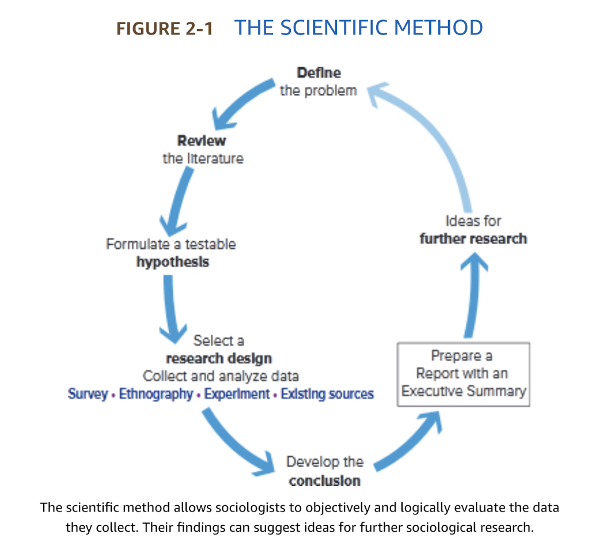
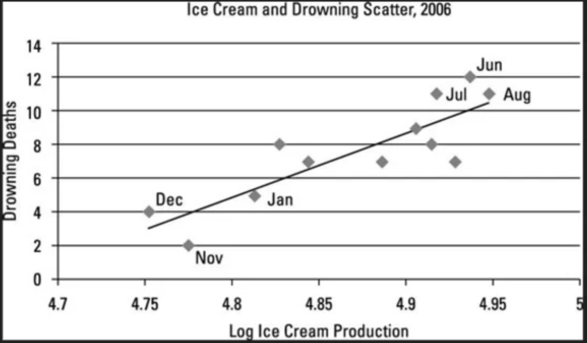
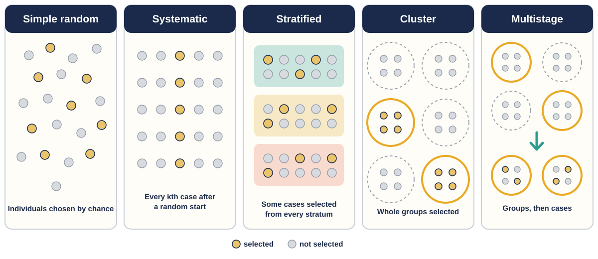
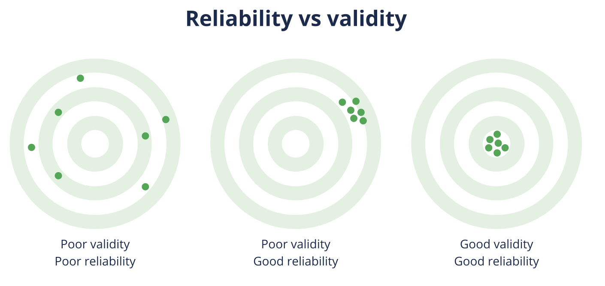
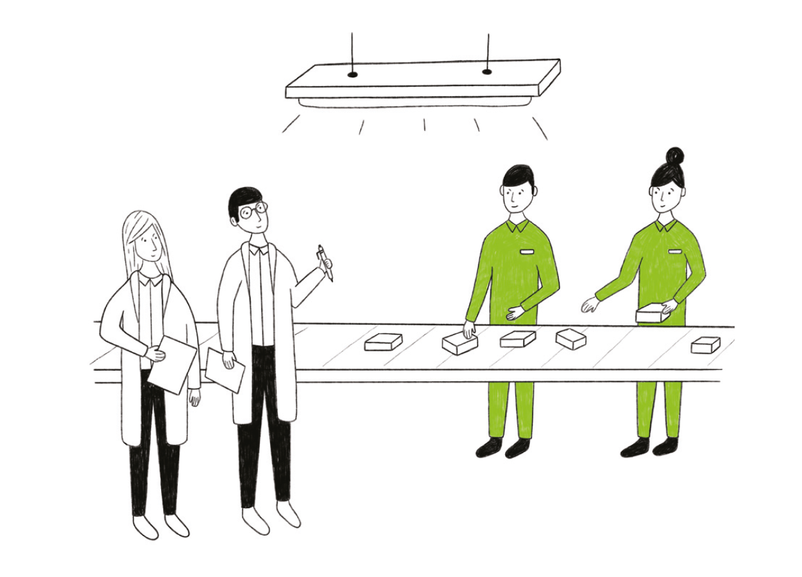

# From Claims to Evidence {background-color="#1B2A4A"}

::: {.takeaway}
Sociological research turns plausible explanations into claims that can be checked.
:::

## Keane's Vaping Study Began with Users' Accounts

- Helen Keane and colleagues monitored an online vapers' forum
- They invited users to describe personal vaporizers in their own words
- The final analysis used **705 responses**; **97%** reported having been daily smokers
- Respondents described vaping spreading through friends, relatives, curiosity, and gifts

::: {.takeaway}
The study showed how users understood the practice—evidence public-health officials need before designing a response.
:::

## Why Sociologists Need Systematic Evidence

- Familiar claims can be repeated long after the evidence has been misunderstood
- A striking result may not reappear when other researchers repeat the study
- A large number of responses can still come from a badly selected sample
- A correlation can look causal when a third variable produces both outcomes
- Research on people can be methodologically strong and still be unethical

::: {.question-box}
What should “studies show” require before we believe it?
:::

## Questions to Ask About a “Studies Show” Headline

::: {.board}
**Headline:** “Studies show that siblings born close in age have much closer relationships as adults.”
:::

::: {.question-box}
Before learning any research terms, what are the first questions you would ask before believing this claim?
:::

## Our Research Project: Popularity Signals and Credibility

::: {.board}
**Research question:** Do visible popularity signals make social-media posts seem more credible?
:::

- **Popularity signals** and **credibility** are still abstract ideas
- We have not yet decided how to observe or measure either one
- We will make the question more precise as we build the study

<!-- ::: {.small}
Hypothetical instructor-designed project. It has no result yet.
::: -->

<!-- Alternative future anchor: repeated exposure and perceived consensus -->
<!-- Alternative future anchor: real identity and expressed opinions -->
<!-- Alternative future anchor: recommendation feeds and convergence of cultural tastes -->
<!-- Alternative future anchor: visible like counts and sharing decisions -->

## What a Hypothesis Is—and When We Use One

- **Hypothesis** — a speculative statement about the relationship between two or more variables
- It is stated **before** the data are collected, so the evidence can **support** or **refute** it

:::: {.columns}
::: {.column width="50%"}
**Start with a hypothesis when…**

- earlier research or theory gives a reason to expect a relationship
- the variables can be measured
- the design can test the prediction, as in a survey, an experiment, or existing data
:::

::: {.column width="50%"}
**Start without one when…**

- the topic is new and little is known yet
- the goal is to describe a setting or learn what a practice means to the people in it
- the researcher plans to develop hypotheses *from* what they observe
:::
::::

::: {.takeaway}
Keane's study began by asking vapers to describe the practice in their own words. Our credibility project can begin with a prediction, if earlier research gives us one.
:::

## A Hypothesis Is Not a Finding

**Hypothesis:** Posts that appear more popular will receive higher perceived-credibility ratings than posts that appear less popular.

| Role | Variable |
|---|---|
| Independent variable (*x*) | Visible popularity signals |
| Dependent variable (*y*) | Perceived credibility |

::: {.example-box}
**Directional** — predicts which way the relationship goes. Ours is directional: more popular-looking posts will be rated *higher*.

**Nondirectional** — predicts only that a relationship exists: "Popularity signals will *affect* credibility ratings."
:::

::: {.question-box}
What else could shape credibility?
:::

::: {.fragment}
Source expertise · prior beliefs · topic familiarity · media literacy · platform familiarity
:::

# The Scientific Method {background-color="#1B2A4A"}

::: {.takeaway}
The scientific method is a cycle from a defined problem to a report, new questions, and further research.
:::

## The Scientific Method Is a Cycle

::: {.center}
{fig-alt="Figure 2-1 shows the scientific method as a cycle: define the problem, review the literature, formulate a testable hypothesis, select a research design and collect and analyze data, develop the conclusion, prepare a report with an executive summary, generate ideas for further research, and return to defining the problem."}
:::

## Define the Problem and Review the Literature

**Define the problem**

- State clearly what the study will investigate
- Replace a broad topic with a researchable question

**Review the literature**

- Examine relevant scholarly studies and information
- Refine the problem and possible data-collection techniques
- Reduce avoidable mistakes

::: {.small}
For our project: What is already known about popularity cues, source credibility, and online judgment?
:::

## Operational Definitions Make Concepts Measurable

- **Operational definition** — an explanation of an abstract concept specific enough for a researcher to assess it

| Abstract concept | Operational definition in our project |
|---|---|
| Popularity signals | The visible likes and shares shown beside an otherwise identical post |
| Perceived credibility | The average of three **1–7 ratings**: the information seems accurate, trustworthy, and believable |

::: {.small}
For each item: **1 = strongly disagree** · **7 = strongly agree**
:::

::: {.board}
**Refined research question:** Do otherwise identical social-media posts receive higher average credibility scores when they display more likes and shares?
:::

::: {.question-box}
Does this score capture credibility—or whether participants already agree with the post?
:::

## Hypotheses, Variables, and Causal Logic

- **Hypothesis** — a speculative statement about the relationship between two or more variables
- **Variable** — a measurable trait or characteristic that changes under different conditions
- The **independent variable** (*x*) is hypothesized to influence the **dependent variable** (*y*)
- **Causal logic** links a condition or variable to a consequence, with one leading to the other

::: {.takeaway}
In our hypothesis: popularity signals (*x*) → perceived credibility (*y*).
:::

## Ice Cream Sales and Drowning Deaths

{fig-alt="Illustrative scatterplot showing that monthly ice-cream production and drowning deaths rise together, with summer months near the upper end of both measures."}

## Correlation Does Not Establish Causation

:::: {.columns}
::: {.column width="46%"}
- **Correlation** — a change in one variable coincides with a change in another
- It may indicate causality, but it does not establish it

Does ice cream cause drowning?

:::
::: {.column width="54%"}
{fig-alt="Illustrative scatterplot showing that monthly ice-cream production and drowning deaths rise together, with summer months near the upper end of both measures." height=275}
:::
::::

::: {.fragment}
**Third variable:** summer weather increases both ice-cream consumption and opportunities for swimming.
:::

::: {.small}
Schaefer's source case: reading and comprehension skill can influence both news-medium choice and measured knowledge. In our project, platform familiarity or prior belief could influence both engagement and credibility judgments.
:::

## A Sample Represents a Larger Population

- **Population** — the entire group the researcher wants to understand
- **Sample** — the smaller group actually studied
- A **representative sample** reflects the population well enough to support conclusions about it

::: {.takeaway}
The conclusion cannot honestly reach further than the population the sample represents.
:::

## Probability Sampling Uses Chance

::: {.center}
{fig-alt="Five probability-sampling diagrams. Simple random selects scattered individuals. Systematic selects individuals at a regular interval after a random start. Stratified selects individuals from every subgroup. Cluster selects entire groups. Multistage first selects groups and then individuals within those groups." width=1120}
:::

::: {.small}
Simple random · systematic · stratified · cluster · multistage
:::

## Convenience and Snowball Samples Are Nonrandom

- **Convenience sample** — recruits people who are readily accessible
- **Snowball sample** — participants help recruit others through their networks
- **Self-selected sample** — people decide for themselves whether to participate

::: {.takeaway}
Nonrandom samples can be useful, especially for hard-to-reach groups, but they limit generalization.
:::

## Sample Size Cannot Repair Selection Bias

- A self-selected website poll may collect tens of thousands of responses
- Those responses still reflect only the people who encountered the poll and chose to answer
- A carefully selected sample of **1,500** can represent a population more accurately

::: {.takeaway}
Sample size affects precision; the route into the sample affects representativeness.
:::

## Sampling the Credibility Project

::: {.question-box}
Whose judgment are we trying to explain?
:::

- KU students, adults in Kuwait, or users of one platform are different populations
- Recruiting only the instructor's followers would create a convenience sample
- Recruiting only heavy users could exaggerate platform familiarity
- A defensible conclusion names the population the sample can actually represent

::: {.small}
This is a design decision, not a finding.
:::

<!--
Inactive slide: The American Community Survey Checks Data Quality

- Schaefer's education–income example uses the U.S. **American Community Survey**
- The Census Bureau surveys approximately **3.5 million households** each year
- About **98%** of approached households participate
- Responses are checked against similar households and reviewed for reliability

::: {.takeaway}
A large sample matters only when selection, participation, and quality checks are also strong.
:::
-->

## Validity and Reliability Ask Different Questions

:::: {.columns}
::: {.column width="47%"}
- **Validity** — does the measure truly reflect the phenomenon under study?
  - Does our three-item score capture credibility rather than agreement?
- **Reliability** — does the measure produce consistent results?
  - Do its items work consistently across people and conditions?
:::
::: {.column width="53%"}
{fig-alt="Three targets compare poor validity and reliability, poor validity with good reliability, and good validity with good reliability." }
:::
::::

::: {.question-box}
Could a measure be reliable but invalid?
:::

## Control Variables Test Rival Explanations

- **Control variable** — a factor held constant to test the relative impact of an independent variable
- Keep the post wording, source name, image, topic, and layout identical
- Measure or balance prior belief, topic familiarity, media literacy, and platform familiarity

::: {.takeaway}
If more than the popularity signal changes, we cannot know what produced the credibility difference.
:::

## Select a Design That Can Answer the Question

::: {.smaller}
| Design | What it could tell us |
|---|---|
| **Experiment** | **Change** the displayed likes and shares while holding the post constant, then **compare** credibility scores. This can support a causal claim if the groups differ only in the signal. |
| **Survey** | **Ask** people about their exposure to popularity cues and their trust judgments. This can identify an association, but it cannot isolate the effect of the visible numbers. |
| **Observation or digital traces** | **Observe** how engagement and sharing unfold on real platforms. This reveals natural behavior, but not whether visible popularity caused a judgment. |
| **Existing sources** | **Reanalyze** data collected earlier. This works only if the dataset already contains suitable measures, sampling information, and relevant controls. |
:::

::: {.small}
The design determines both what researchers can see and what they can honestly claim.
:::

## Conclusions Lead to Reports and New Questions

- A conclusion states whether the evidence supports or refutes the hypothesis
- It must identify limits, exceptions, and rival explanations that remain
- Researchers then prepare a report, often beginning with an executive summary
- The conclusion should generate ideas for future research

::: {.board}
End of one study → report → new question → next study
:::

# Schaefer's Education–Income Source Case {background-color="#1B2A4A"}

::: {.takeaway}
The textbook's worked example shows how a hypothesis can be supported without becoming a universal law.
:::

## The Textbook Hypothesis Links Education to Income

::: {.board}
**Hypothesis:** The higher one's educational degree, the more money one will earn.
:::

- Independent variable (*x*): level of education
- Dependent variable (*y*): income
- Operational definitions: years of schooling and income reported for the past year

::: {.small}
This is Schaefer's source case, based on U.S. Census data.
:::

## Macro-Level Evidence Does Not Answer a Micro-Level Question

- The literature review found that U.S. states with more educated residents also had higher household incomes
- That is a **macro-level** relationship between state characteristics
- The hypothesis asks a **micro-level** question about individuals

::: {.takeaway}
A pattern among states does not by itself prove the same relationship among people.
:::

## Figure 2-4 Supports the Education–Earnings Hypothesis

::: {.smaller}
| Yearly earnings | High school diploma or less | Associate's degree or more |
|---|---:|---:|
| $60,000 or more | 25% | 58% |
| $40,000–$59,999 | 27% | 23% |
| $25,000–$39,999 | 30% | 14% |
| $15,000–$24,999 | 14% | 3% |
| Under $15,000 | 4% | 2% |
:::

::: {.small}
Schaefer Figure 2-4, U.S. data. The pattern supports the hypothesis; it does not say education determines every person's income.
:::

## Exceptions, Inequality, and Local Context Matter

- A high-earning school dropout and a modest-earning doctorate holder are exceptions within the pattern
- Family resources, occupation, gender, and other factors may alter the relationship
- Control variables help test education's relative impact
- Kuwait's credential-linked salary and occupational structures make “the degree itself” especially difficult to isolate as a recurring local project

<!-- ::: {.takeaway} -->
<!-- Keep the source finding; do not turn it into an invented Kuwaiti statistic. -->
<!-- ::: -->

# Major Research Designs {background-color="#1B2A4A"}

::: {.takeaway}
The best design depends on the question, and every design trades one strength for another.
:::

## Schaefer's Four Major Research Designs

::: {.board}
A research design is a detailed plan or method for obtaining data scientifically.
:::

:::: {.columns}
::: {.column width="32%"}
**The four designs**

- **Survey**
- **Ethnography**
- **Experiment**
- **Use of existing sources**
:::

::: {.column width="68%"}
**What shapes the choice**

- **Theory and hypothesis** — testing whether *x* causes *y* points toward an experiment; learning what a practice means points toward ethnography
- **Cost and time** — a questionnaire can reach hundreds of people in weeks; fieldwork can take years
- **Access** — some groups, such as illegal drug users, have no list to sample from
- **Ethics** — some variables cannot be manipulated without harming people, such as job loss or illness
:::
::::

::: {.question-box}
Our credibility hypothesis predicts that popularity signals *cause* higher ratings. Which design could test that?
:::

## Surveys Use Interviews and Questionnaires

- **Survey** — an interview or questionnaire that provides information about how people think and act
- **Interview** — face-to-face, phone, or online questioning; higher response and opportunities to probe
- **Questionnaire** — a printed or written form; cheaper for large samples
- Surveys can reach many people, but sampling and wording determine what the answers mean

## Cross-Sectional and Longitudinal Studies Use Time Differently

| | Cross-sectional study | Longitudinal study |
|---|---|---|
| **Timing** | Collects data at one point or during a short period | Collects data repeatedly over an extended period |
| **Best for** | A snapshot and comparisons between groups | Change, sequence, and trajectories over time |
| **KU example** | Compare first- and fourth-year students today | Follow students from first year through graduation |
| **Main limitation** | Group differences do not show that individuals changed | Takes more time and risks **attrition** as participants leave |

::: {.small}
A **panel study** follows the same people. A **repeated cross-sectional study** draws new samples from the same population at different times.
:::

::: {.takeaway}
These are ways of organizing time, not separate data-collection methods: either can use surveys, observation, or existing records.
:::

## Cell-Phone and Web Surveys Change the Sample

- In 2018, **54%** of U.S. households—and **72%** of people ages 18–29—were reachable only by cell phone
- Completing a cell-phone survey took about nine calls, compared with five for a landline
- Excluding cell-only users could distort the population represented
- Web surveys are inexpensive, but opt-in participation can create self-selection
- A carefully drawn web sample can still produce valid results

::: {.small}
These are Schaefer's U.S. source figures; the transferable lesson is coverage bias.
:::

## Question Wording and Interviewers Shape Answers

- Effective questions are simple, clear, specific, and unbiased
- Wording must change as social life changes
- Leading, loaded, or double-barrelled questions damage validity
- Interviewer characteristics can influence what respondents disclose

::: {.question-box}
“Don't you agree that irresponsible social-media use harms students' grades and family life?”
:::

## Quantitative and Qualitative Research Answer Different Questions

- **Quantitative research** collects and reports data primarily in numerical form
- **Qualitative research** relies on field and naturalistic settings, often with smaller groups

| Quantitative strength | Qualitative strength |
|---|---|
| Breadth, comparison, patterns across cases | Depth, context, meanings inside a setting |

::: {.takeaway}
The strongest answer may combine methods rather than treating them as rivals.
:::

## Ethnography Studies a Social Setting in Depth

- **Ethnography** — study of an entire social setting through extended systematic fieldwork
- **Observation** — direct participation in closely watching a group or organization
- Ethnographers also collect historical information and conduct interviews
- Detailed notes make the method systematic rather than casual

::: {.small}
A diwaniya may be surveyed, but its interaction order is best understood by observing it over time.
:::

## Alice Goffman Used Long-Term Participant Observation

- **Participant observation** — the sociologist joins a setting for an extended period to understand how it operates
- Alice Goffman conducted **six years of fieldwork** in a heavily policed, low-income Philadelphia neighborhood
- The study argued that warrants and police contact shaped everyday routines and relationships
- The study later prompted debate about evidence, anonymization, researcher involvement, and ethical boundaries

::: {.takeaway}
Immersion can reveal what brief visits miss—and create difficult obligations for the researcher.
:::

## Visual Sociology Treats Images as Data

- **Visual sociology** — the use of photographs, film, and video to study society
- Images are evidence, not decoration
- Charles Suchar photographed changing neighborhoods over time
- Repeated satellite or aerial images can track land use, building density, roads, and green space
- Images show **what changed and where**; interviews and records help explain **why**

::: {.question-box}
What could repeated satellite images reveal about a neighborhood—and what could they not explain?
:::

## Experiments Manipulate an Independent Variable

- **Experiment** — an artificially created situation that allows a researcher to manipulate variables
- The **experimental group** is exposed to the independent variable
- The **control group** is not
- A study can use more than one experimental group, each receiving a different version of the treatment
- Groups should be comparable except for the treatment

::: {.small}
“Treatment group” is a common synonym; Schaefer's term is **experimental group**.
:::

## The Credibility Project Fits an Experiment

Comparable participants all see the same post. Only what appears beside it changes.

| Group | What participants see beside the post |
|---|---|
| Experimental group A | High popularity signals: many likes and shares |
| Experimental group B | Low popularity signals: few likes and shares |
| Control group | No likes, shares, or other interactions |

Then compare average perceived-credibility scores across the three groups.

::: {.takeaway}
The control group is the baseline. It shows whether high signals raise credibility, low signals lower it, or both.
:::

::: {.question-box}
What must remain identical for popularity signals to be the only plausible cause?
:::

::: {.small}
This is a hypothetical design. No result is claimed.
:::

## The Hawthorne Effect Changes Observed Behavior

:::: {.columns}
::: {.column width="58%"}
- At the Western Electric Hawthorne plant, many changes in working conditions were followed by higher productivity
- Even reduced lighting appeared to produce improvement
- **Hawthorne effect** — the unintended influence observers of experiments can have on their subjects
:::
::: {.column width="42%"}
{fig-alt="Illustration of researchers observing two workers beneath factory lighting." height=325}

Illustrative schematic

:::
::::

::: {.takeaway}
Being studied can become part of what the study measures.
:::

## Existing Sources Allow Nonreactive Research

- **Secondary analysis** uses previously collected, publicly accessible information and data
- It is often **nonreactive**: the analysis does not influence people's behavior
- Census, health, birth, death, marriage, and divorce records are common sources
- The limitation is fit: data collected for another purpose may omit what the new question needs

## Content Analysis Codes Cultural Materials

- **Content analysis** — systematic coding and objective recording of data, guided by a rationale
- Sources can include newspapers, television, websites, scripts, diaries, songs, folklore, and legal documents
- Schaefer reports that women's sports received **3.2%** of airtime in a 2015 content analysis

::: {.question-box}
What categories would you code in Kuwaiti television drama or public social-media posts?
:::

## Table 2-3: Advantages and Limitations

::: {.smaller}
| Design | Examples | Advantages | Limitations |
|---|---|---|---|
| **Survey** | Questionnaires, interviews | Information on specific issues | Can be costly and time-consuming |
| **Ethnography** | Observation | Detailed information about a group or organization | Time-consuming and costly |
| **Experiment** | Manipulating participants' experience | Direct measures of behavior | Ethical limits on manipulation |
| **Existing sources** | Census or health data | Cost-efficient | Limited to data gathered for another purpose |
:::

<!-- ::: {.takeaway} -->
<!-- Name both the best design and what choosing it costs. -->
<!-- ::: -->

<!--
Inactive slide: Quiz

::: {.board}
Two skills: identify *x* and *y*, then match a question to one of Schaefer's four designs.
:::

- Survey
- Ethnography
- Experiment
- Existing sources
-->

## Identify the Research Design

:::: {.smaller}
1. Researchers ask **1,200 KU students** the same questions about commuting and stress.

   ::: {.fragment}
   **Survey** — standardized questions collect reported experiences.
   :::

2. A researcher spends a semester in architecture studios, observing teamwork and interviewing students.

   ::: {.fragment}
   **Ethnography** — extended fieldwork studies a social setting in depth.
   :::

3. Participants are randomly shown the same post with either high or low likes and shares.

   ::: {.fragment}
   **Experiment** — the researcher manipulates one condition and compares outcomes.
   :::

4. Researchers analyze previously collected hospital records to study readmission patterns.

   ::: {.fragment}
   **Existing sources** — the study reuses data collected for another purpose.
   :::
::::

## Network Analysis and Digital Traces Extend the Toolkit

:::: {.columns}
::: {.column width="50%"}
**Social network analysis**

- Maps who is connected to whom
- Examines what moves through relationships
- Reveals bridges, clusters, and influence
:::

::: {.column width="50%"}
**Computational social science**

- Uses posts, searches, streams, and other digital traces
- Studies behavior at large scale
- Raises privacy, consent, and platform-access questions
:::
::::

<!-- ::: {.small} -->
<!-- Instructor enrichment beyond Schaefer's four designs; non-examinable. -->
<!-- ::: -->

# Ethics and Methodology {background-color="#1B2A4A"}

::: {.takeaway}
Research quality includes what researchers owe the people whose lives become data.
:::

## The ASA Code Sets Seven Ethical Duties

1. Maintain objectivity and integrity
2. Respect rights, dignity, and diversity
3. Protect subjects from personal harm
4. Preserve confidentiality
5. Seek informed consent in private contexts
6. Acknowledge collaboration and assistance
7. Disclose all financial support

<!-- ::: {.small} -->
<!-- The American Sociological Association first published its code in 1971 and revised it most recently in 2018. Review boards screen human-subject research. -->
<!-- ::: -->

## Rik Scarce Chose Confidentiality

- In 1993, a federal grand jury questioned doctoral student Rik Scarce
- He was researching environmental activists and knew at least one suspect in a laboratory raid
- Scarce refused to disclose what he knew
- He spent **159 days in jail**; the ASA supported his appeal

::: {.question-box}
When a legal demand conflicts with a promise of confidentiality, what should a researcher do?
:::

## The Facebook Experiment Tested Informed Consent

- In 2014, researchers altered the News Feeds of **689,000** Facebook users
- The experiment tested whether emotional content spread through a network
- Users were not asked for meaningful informed consent

::: {.question-box}
Which ASA principles are at stake?
:::

<!-- ::: {.small} -->
<!-- Instructor enrichment: a contemporary ethics case, not a Schaefer source case. -->
<!-- ::: -->

## Exxon Funding Created a Conflict of Interest

:::: {.columns}
::: {.column width="45%"}
{fig-alt="Cleanup workers use hoses along an oil-covered shoreline after the Exxon Valdez spill." height=305}

U.S. Navy / National Archives · public domain

:::
::: {.column width="55%"}
- Exxon faced a multibillion-dollar fine after the 1989 spill
- It funded research supporting its legal argument that large jury awards reflected faulty deliberation
- The researchers **disclosed Exxon's support**, as the ASA code requires
- Exxon still had a direct financial stake and helped set the research agenda
:::
::::

::: {.takeaway}
Disclosure is necessary, but it does not remove a conflict of interest or a funder's power to shape which questions receive resources.
:::

## Value Neutrality Applies to Interpretation

- **Value neutrality** — Weber's principle that personal values may guide question choice but must not influence data interpretation
- Researchers must accept findings that contradict their views or theories
- Peter Rossi's estimate of homelessness in 1980s Chicago fell below advocates' estimates and drew strong criticism

::: {.takeaway}
Methodological honesty can disappoint the people a researcher hoped to help.
:::

<!--
Inactive slide: Feminist Methodology Changes the Research Agenda

- A theoretical orientation shapes questions asked—and questions overlooked
- Feminist scholars linked work with family and paid work with unpaid domestic work
- Researchers tend to involve and consult participants more
- They are more oriented toward change, public awareness, and policy
- They often draw on history, law, and other disciplines

::: {.small}
Teach the methodological contribution soberly: what becomes researchable when neglected experience enters the question.
:::
-->

## Morris's Result Did Not Show Mentoring Caused Harm

- **Hypothesis:** mentoring would reduce problems among children with an incarcerated parent
- **Unexpected result:** the mentored group had more reported problems
- The groups already differed in prior problems, age, and length of parental absence
- The program's duration and emphasis on school success also shaped what it could change

::: {.takeaway}
Before blaming the intervention, compare the groups at baseline and test rival explanations.
:::

# Data, Statistics, and Reporting {background-color="#1B2A4A"}

::: {.takeaway}
Research is incomplete until evidence is summarized, interpreted, and reported clearly.
:::

## Percentage, Mean, Mode, and Median Summarize Data

- **Percentage** — a portion of 100; useful for comparing groups of different sizes
- **Mean** — values added together and divided by the number of values
- **Mode** — the single most common value
- **Median** — the midpoint dividing ordered values into two equal-sized groups

::: {.board}
Illustrative scores: **5, 7, 7, 8, 9, 10** → mean ≈ **7.7** · mode **7** · median **7.5**
:::

## Cross-Tabulations Show Relationships Between Variables

- **Cross-tabulation** — a table showing the relationship between two or more variables

| Preferred study place | Café | Home |
|---|---:|---:|
| Under 25 | 62% | 38% |
| 25 and over | 41% | 59% |

::: {.small}
Illustrative values for reading practice, not a research finding. Tables and graphs clarify patterns, but scales and categories can also mislead.
:::

## Useful Data Requires a Defined Outcome and a Missing-Group Check

- Dave Eberbach found that local patterns disappeared inside state and county averages
- **1. Define the outcome:** what would count as success or harm?
- **2. Choose the evidence:** which measure and design could detect it?
- **3. Check who is missing:** whose experience may be absent from the data?

::: {.board}
**Example:** A hospital introduces an appointment app. Success might mean fewer missed appointments—not simply more clicks. The study must also ask who cannot use the app easily.
:::

::: {.question-box}
What would you measure besides app use?
:::

## A Research Report Completes the Cycle

- Narrow the topic enough to answer it well
- Search books, scholarly databases, government documents, and relevant organizations
- Evaluate online authorship, sponsorship, date, and possible bias
- Build an outline with a connected introduction and conclusion
- Draft, pause, revise, and read difficult passages aloud
- Cite every borrowed idea or exact phrase

::: {.takeaway}
The report makes the method, evidence, limits, and conclusion open to evaluation.
:::

# From Design to Defensible Knowledge {background-color="#1B2A4A"}

::: {.takeaway}
A conclusion is credible when the route from question to evidence remains visible.
:::

## The Credibility Project from Question to Conclusion

1. Define popularity signals and a three-item perceived-credibility score
2. State the hypothesis without calling it a finding
3. Select a population and defensible sample
4. Hold the post constant and manipulate only the signals
5. Check validity, reliability, and rival explanations
6. Protect consent, privacy, and confidentiality
7. Report support or refutation, limits, and future questions

::: {.board}
No data were collected here, so there is no verdict to announce.
:::

## Research Skills Travel Across Majors

- **Medicine:** randomized controlled trials assign participants to treatment or control groups by chance, then track benefits, adverse effects, and informed consent
- **Architecture:** compare similar hospital wards to ask how daylight, noise, layout, and wayfinding relate to sleep, stress, or recovery
- **Business:** market research depends on representative samples and unbiased questions
- **Computer science:** operationalize “interaction” and “time on platform,” then audit opaque algorithms through their inputs, outputs, errors, and overlooked groups

::: {.question-box}
In your field: what outcome would you measure, which design would you choose, and who might the data miss?
:::

## From a Plausible Claim to a Defensible Conclusion

- Define the problem and its concepts
- Treat hypotheses as questions for evidence, not preferred answers
- Match the design to the claim
- Ask who entered the sample and who did not
- Test rival explanations
- Protect participants and interpret results honestly
- Report limits and begin the next research cycle

::: {.takeaway}
“Studies show” is the start of an evaluation, not the end of one.
:::
