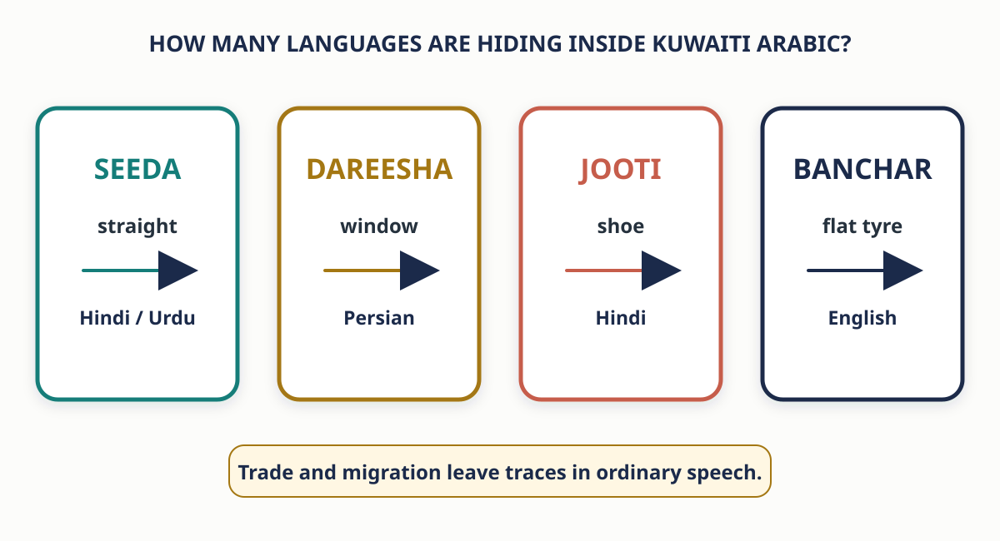
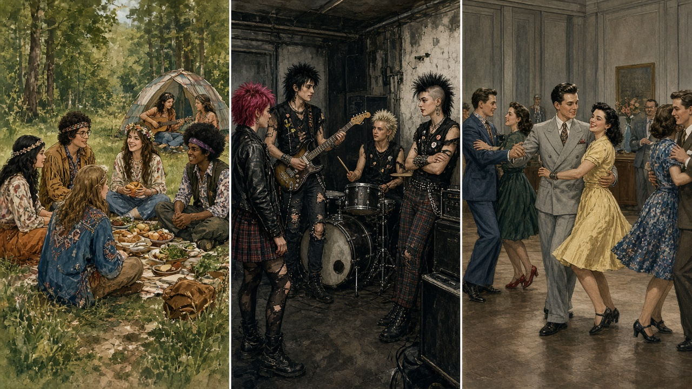

# What Is Culture? {background-color="#1B2A4A"}

::: {.takeaway}
Culture is learned so early and shared so completely that it feels like nature. Sociology makes it visible again.
:::

<!-- ## Horace Miner's Report on the Nacirema {.smaller}

An anthropologist describes a society he studied (Miner 1956):

> "While much of the people's time is devoted to economic pursuits, a large part of the fruits of these labors and a considerable portion of the day are spent in ritual activity. The focus of this activity is the human body, the appearance and health of which loom as a dominant concern in the ethos of the people."

> "The focal point of the shrine is a box or chest which is built into the wall. In this chest are kept the many charms and magical potions without which no native believes he could live."

::: {.question-box}
What do you think of this society? Could you live in such a culture?
:::

:::: {.fragment}
::: {.arrow-flow}
NACIREMA → AMERICAN · the shrine is the bathroom · the medicine men are physicians
:::
:::: -->

## Fiji's Body Ideal Changed After Television Arrived

- In Fiji, a robust, nicely rounded body was traditionally the ideal for men and women
- "You've gained weight" was a compliment; "Your legs are skinny" was an insult
- Cable television arrived in **1995**, carrying programs made elsewhere
- For the first time, eating disorders appeared among young people, especially young women (A. Becker 2007)

::: {.takeaway}
Studying culture in places like Fiji sheds light on our own society as well.
:::

## Culture Is Learned, Shared, and Transmitted

- **Culture** — the totality of learned, socially transmitted customs, knowledge, material objects, and behavior
- It includes the ideas, values, and artifacts of groups of people
- Not only the fine arts: a Rembrandt portrait **and** graffiti, slang words, ice-cream cones, and rock music are all culture
- A tribe that cultivates soil by hand has as much culture as a people that relies on computer-operated machinery

<!-- ## Kuwaiti Culture Is Visible in Ordinary Life

{fig-alt="Illustrated cards showing bakhour, Arabic coffee hospitality, slang on a phone, and a pickup truck."}

::: {.question-box}
Which of these would be immediately meaningful to someone raised in Kuwait—and which would require explanation?
::: -->

## A Society Shares a Territory and a Common Culture

- **Society** — a fairly large number of people who live in the same territory, are relatively independent of people outside their area, and participate in a common culture
- A society is the largest form of human group
- A city, however populous, is not automatically a society; it depends on wider political, economic, and cultural institutions
- Members learn the culture and transmit it from one generation to the next

## Culture Works as a Tool Kit of Taken-for-Granted Assumptions

- Culture supplies a **tool kit** of habits, skills, and styles for acquiring knowledge, dealing with kin, and entering the job market
- Without social transmission, each generation would have to reinvent communication, "not to mention the wheel"
- You assume theaters will have seats, physicians will keep your information confidential, and a red light means you should stop.

::: {.question-box}
What do you assume, without thinking, in your day to day life?
:::

<!-- ## Adorno's Culture Industry Standardizes What Consumers Want

- Text, sound, and video now cross borders instantly, so some aspects of culture transcend nations
- **Culture industry** — Theodor Adorno's term for the worldwide industry that standardizes the goods and services demanded by consumers
- Adorno contends that the primary global effect of popular culture is to **limit people's choices**
- Yet the culture industry does not always permeate borders: sometimes it is embraced, sometimes soundly rejected -->

## Murdock's Cultural Universals

- **Cultural universals** — common practices and beliefs that all societies have developed
- Many are adaptations to essential human needs such as food, shelter, and clothing
- George Murdock (1945) listed athletic sports, cooking, dancing, visiting, personal names, marriage, medicine, religious ritual, funeral ceremonies, and trade
- The practice is universal; its **expression** varies between cultures and changes over time

::: {.small}
Marriage exists everywhere. One society lets members choose their partners; another encourages marriages arranged by parents.
:::

## Ethnocentrism Judges Other Cultures by Our Own Standards

- **Ethnocentrism** — the tendency to assume that one's own culture and way of life represent the norm or are superior to all others (William Graham Sumner 1906)
- Everyday language carries it: *underdeveloped*, *backward*, *primitive*; what "we" believe is religion, what "they" believe is superstition
- Cultures who treat cattle as food may look down on India's Hindu culture, which views the cow as sacred
- People from Kuwait may be surprised by the disrespect U.S. children show their parents

::: {.takeaway}
Our view of the world is dramatically influenced by the society in which we were raised.
:::

## Cultural Relativism Views Behavior from Inside Its Own Culture

- **Cultural relativism** — viewing people's behavior from the perspective of their own culture
- It places a priority on understanding other cultures rather than dismissing them as "strange" or "exotic"
- It employs the **value neutrality** Max Weber saw as essential to scientific study
- It does **not** require accepting every cultural variation; it requires a serious and unbiased effort to evaluate norms, values, and customs in their own context

::: {.small}
Schaefer's examples: polygamy, bullfighting, and monarchy must each be examined within the culture where it is found.
:::

<!-- ## Child Marriage Tests the Limits of Cultural Relativism

- Most people in North America cannot fathom a 12-year-old girl marrying
- Figure 3-1: in **16 countries**, 40 percent or more of women under 18 are married (UNICEF 2018)
- The U.S. government has spent millions to discourage the practice in countries with the highest rates
- Relativism asks: should one society spend its resources to dictate the norms of another?
- Officials answer: child marriage deprives girls of education, threatens their health, and weakens public-health efforts -->

## Eating with Your Hands Can Follow Strict Etiquette

- An outsider may treat cutlery as the standard and eating with one's hands as a lack of manners
- Across parts of South Asia, the Middle East, and Africa, eating with the hands has learned rules about **which hand**, which foods, sharing, and cleanliness
- The method is not "no etiquette." It is a **different system of etiquette** (Mann et al. 2011)

::: {.takeaway}
Cultural relativism asks what a practice means to the people who know its rules.
:::

<!-- ALTERNATIVE CULTURAL-RELATIVISM SLIDE 1
## Eye Contact Can Signal Attention or Disrespect

- In some settings, direct eye contact signals honesty and attention
- In other settings, especially across differences in age or status, avoiding prolonged mutual gaze can signal deference
- The movement of the eyes is the same; the local relationship changes its meaning
- Cultural relativism begins by learning that local code before judging the person
-->

<!-- ALTERNATIVE CULTURAL-RELATIVISM SLIDE 2
## Silence Can Signal Comfort, Respect, or Disengagement

- Some conversational cultures treat a pause as awkward and rush to fill it
- Others allow longer silences without treating them as a communication failure
- A quiet student, colleague, or guest may be showing respect rather than indifference
- Cultural relativism asks us to interpret silence inside the interactional rules that produced it
-->

## Sociobiology Traces Social Behavior to Genetics

- **Sociobiology** — the systematic study of how biology affects human social behavior
- Sociobiologists assert that many cultural traits, such as the near-universal expectation that women nurture and men provide, are rooted in genetic makeup rather than learned
<!-- - It builds on Charles Darwin's (1859) theory of evolution -->
<!-- - **Natural selection** — Darwin's term for adaptation to the environment through random genetic variation -->

::: {.small}
In its extreme form, sociobiology suggests that all behavior results from genetic or biological factors and that social interaction plays no role.
:::

## Most Sociologists Say Behavior, Not Genes, Defines Social Reality

- Sociobiologists study groups that share characteristics, not "why Fred is more aggressive than Jim"
- They stress the genetic heritage all humans share and show little interest in alleged differences between racial groups or nationalities
- Genetic markers linked to behavior are **not deterministic**: family cohesiveness and peer groups can override them (Guo et al. 2008)
- Most social scientists accept a biological basis for social behavior, yet hold that people's **behavior**, not their genetic structure, defines social reality

::: {.small}
Conflict theorists fear that sociobiology could be used to argue against helping disadvantaged people, such as struggling schoolchildren.
:::

## Thinking Critically: Three Universals from a Functionalist View

::: {.board}
Choose three items from Murdock's list of cultural universals.
:::

- Why is each practice found in every culture?
- What function does it serve for the society?
- How does its **expression** here differ from its expression in a culture you know from travel, family, or media?

::: {.small}
Murdock's list: athletic sports · cooking · dancing · visiting · personal names · marriage · medicine · religious ritual · funeral ceremonies · trade
:::

# The Role of Language {background-color="#1B2A4A"}

::: {.takeaway}
Language does more than describe reality. It also shapes what a culture notices, values, and passes on.
:::

## Language Is a Component of Cultural Capital

- Language is one of the major elements of culture
- **Cultural capital** (from Bourdieu, chapter 1 lecture): noneconomic assets such as family background and past educational investments, reflected in a person's knowledge of language and the arts
- A shared language simplifies daily exchange: you ask for a *flashlight* without drawing one; in England you would ask for a *torch*
- One term can still carry several meanings: a *mouse* may be an animal or a computer device; context tells you which one

## How Many Languages Are Hiding Inside Kuwaiti Arabic?

::: {.large .center}
[سيدا]{.fragment} · [وانيت]{.fragment} · [دريشة]{.fragment} · [جوتي]{.fragment} · [بنچر]{.fragment}
:::

::: {.question-box}
Guess the source language of each word. What history would you expect ordinary speech to preserve?
:::

## Kuwaiti Arabic Records Trade, Migration, and New Technology

{fig-alt="Four cards linking Kuwaiti words to Hindi, Urdu, Persian, and English."}

<!-- ::: {.small} -->
<!-- The origin of **وانيت** (*wanait*, pickup truck) is disputed. One dictionary proposes English *vanette*; an Aramco tradition links it to *one-eight*. Neither should be presented as settled fact. -->
<!-- ::: -->

## Seven Thousand Languages Carry Seven Thousand Cultures

- About **7,000 languages** are spoken today, many more than the number of countries
- English makes extensive use of war vocabulary: "conquering" space, "waging war" on drugs, a "killing" on the stock market, "bombing" an exam
- The Sami people of northern Norway and Sweden have a rich diversity of terms for snow, ice, and reindeer (Haviland et al. 2015; Magga 2006)
- An outside observer could gauge what matters to a culture from the words it has multiplied

<!-- ::: {.question-box} -->
<!-- What does Kuwaiti Arabic name with unusual richness? What does that vocabulary reveal? -->
<!-- ::: -->

<!-- ## Some Languages Often Leave "I" Unspoken

- The claim that some cultures have **no word or concept for "I" or "my" is not supported**
- Arabic itself can encode the speaker or possessor without a separate word: **أدرس** contains first-person meaning; **كتابي** contains "my"
- Japanese has several first-person forms but often omits a pronoun when context makes the person clear; linguists call this a **zero pronoun**
- The interesting difference is not the absence of selfhood. It is how much information the language expects listeners to recover from context -->

## Language Is the Foundation of Every Culture

- **Language** — an abstract system of word meanings and symbols for all aspects of culture
- It includes speech, written characters, numerals, symbols, and nonverbal gestures and expressions
- Because language is the foundation of every culture, the ability to speak other languages is crucial to intercultural relations
- During the Cold War, the U.S. government built special Russian-language schools for diplomats and 
military advisers
- Hospitals, airlines, schools, diplomacy, and international business all depend on people who can move accurately between languages

## Language Shapes Reality, Not Only Describes It

- Most people from other cultures cannot make the Sami distinctions about snow and ice, so they are less likely to **notice** them
- Terms such as *mailman*, *policeman*, and *fireman* reflect, though do not determine, who is imagined in those jobs
- Language communicates a culture's most important norms, values, and sanctions, which is why the decline of an old language is so sensitive

## Interaction Increasingly Takes Place by Text

- More interaction now happens through mobile devices than face to face
- Social scientists are beginning to study how texting language varies across societies and cultures

::: {.question-box}
How does the language you text in differ from the language you speak, and from the language you write for a professor?
:::

## Platforms Now Help Shape the Words People Use

- **Algospeak** — altered or substitute words created partly to avoid automated content moderation
- Examples include *unalive* for *die* or *kill*, and creative spellings that remain legible to people while trying to evade a filter
- Users respond to what they **believe** an algorithm will suppress; the rules are opaque, so the language keeps changing
- A platform is not only a channel for culture. Its technical rules can become a pressure on vocabulary (Steen et al. 2023)

## Nonverbal Communication Is Learned, Not Inborn

- **Nonverbal communication** — the use of gestures, facial expressions, and other visual images to communicate
- Folding your arms in a meeting, hugging a friend in tears, high-fiving a teammate
- We learn these expressions from people who share our culture, including the basic expressions of happiness and sadness (Hall et al. 2019)
- Gently shaking an Arabic coffee cup tells the server, "I am finished"; returning it without the shake can invite another pour (UNESCO; KUNA 2008)
- In many Arab and Asian settings, deliberately showing someone the sole of a shoe can feel insulting; elsewhere it may pass unnoticed

## Specialized Communities Build Nonverbal Vocabularies

- In noisy open-outcry trading pits, traders used hand positions to communicate **buy or sell, price, quantity, and order type**
- Palms toward the body meant **buy**; palms facing away meant **sell**
- Similar gestures could mean different things in different trading pits—another reminder that symbols require a shared code
- [Watch: “Wall Street Trading Floor Hand Signals” (YancyFX)](https://www.youtube.com/watch?v=pUgfycMT2YQ)

## Symbols Carry Meanings That Change with Context

- **Symbols** — the gestures, objects, and words that form the basis of human communication
- The thumbs-up gesture, a gold star sticker, and the smiley face in an e-mail are all symbols
- Many symbols are deceptively simple yet rich in meaning, and they may not mean the same thing in every social context
<!-- - A cross around someone's neck symbolizes religious reverence; over a grave site, a belief in everlasting life; set in flames, hatred -->

## Emoji Meaning Comes from the Message Around It {.smaller}

:::: {.columns}
::: {.column width="54%"}
- A 😂 may express literal laughter, soften a sentence, fill a pause, or function like habitual punctuation
- In this post, news of a death and a laughing-emoji background collide, producing a meaning the writer almost certainly did not intend
- A 💀 can mean "that was so funny I died"; a 👍 can read as warm agreement, a quick acknowledgment, or an abrupt reply

::: {.takeaway}
A symbol has no fixed meaning outside its message, audience, and setting.
:::
:::

::: {.column width="46%"}
{fig-alt="A redacted social-media post announcing a son's death over a background filled with laughing emojis, illustrating a severe mismatch between symbol and context."}
:::
::::

## Thinking Critically: Communication as Cultural Capital

::: {.board}
How can the way you communicate, verbally and nonverbally, be a form of cultural capital?
:::

- Which accents, vocabularies, or greetings open doors in a job interview or a hospital ward?
- Which gestures or forms of address signal that someone "belongs"?
- Who had the chance to learn those codes early, and who is learning them now?

# Norms and Sanctions {background-color="#1B2A4A"}

::: {.takeaway}
Every society encourages the behavior it approves of and discourages the behavior it does not. Norms set the standard; sanctions enforce it.
:::

## Norms Are Established Standards of Behavior

- "Wash your hands before dinner." "Thou shalt not kill." "Respect your elders."
- **Norms** — the established standards of behavior maintained by a society
- For a norm to become significant, it must be widely shared and understood
- Application varies by context: moviegoers insist on silence during a serious film more than during a slapstick comedy or horror movie

## Formal and Informal Norms

- **Formal norms** — generally written down; specify strict punishments for violators
- **Law** — "governmental social control". Formal norms enforced by the state (Donald Black 1995)
- Laws are one example; parking restrictions and the rules of a football or basketball game are also formal norms
- **Informal norms** — generally understood but not precisely recorded, such as standards of proper dress; laughter is the likeliest response to a violation
- In Kuwaiti hospitality, immediately accepting an offered item can feel too eager; a polite refusal followed by the host's insistence lets both sides display modesty and generosity

## Mores and Folkways

- Norms are also classified by their relative importance to society
- **Mores** — norms deemed highly necessary to the welfare of a society, often because they embody its most cherished principles; violation brings severe penalties
- Kuwait, like other nation-states, has strong mores against murder, treason, and child abuse; these are also institutionalized as formal norms
- **Folkways** — norms governing everyday behavior; violation raises comparatively little concern, such as walking up a down escalator

::: {.takeaway}
Formal/informal asks whether the rule is written and punished. Mores/folkways asks how much society cares.
:::

## Sanctions Are Penalties and Rewards

- A driver uses the emergency lane to pass traffic. Someone throws a bottle onto the pavement. A graduate wears shorts to a bank interview.
- **Sanctions** — penalties **and rewards** for conduct concerning a social norm
- Positive sanctions: a pay raise, a medal, a word of gratitude, a pat on the back
- Negative sanctions: fines, threats, imprisonment, stares of contempt

::: {.small}
Littering may be formally illegal in two societies but attract very different levels of public disapproval and enforcement. The written rule alone does not tell us the norm's strength.
:::

## Table 3-1: Norms and Sanctions

| Norms | Positive sanctions | Negative sanctions |
|---|---|---|
| **Formal** | Salary bonus · testimonial dinner · medal · diploma | Demotion · firing from a job · jail sentence · expulsion |
| **Informal** | Smile · compliment · cheers | Frown · humiliation · bullying |

- Sanctions attached to formal norms tend to be formal: the team is penalized 15 yards; the driver pays a fine
- Sanctions for informal norms vary: the candidate in shorts may lose the job, or be so brilliant that the attire is overlooked

## Sanctions Reflect a Culture's Values and Priorities

- The entire fabric of norms and sanctions reflects a culture's values and priorities
- The most cherished values are the most heavily sanctioned; less critical matters carry light, informal sanctions
- During the coronavirus pandemic, people debated whether governments should sanction failure to comply with distancing and face-covering orders

::: {.question-box}
Which behaviors in Kuwait carry the heaviest sanctions? What does that tell you about the values behind them?
:::

## Classify the Norm and Name the Sanction {.smaller}

For each scenario: **(1)** formal or informal norm? **(2)** mores or folkway? **(3)** one negative sanction for violating it, one positive sanction for honoring it.

1. Eating in public during daytime in Ramadan
2. Cutting the line at a supermarket
3. Running a red light
4. Arriving at a wedding in jeans and sneakers
5. Hosting a guest and offering nothing, not even water
6. Scrolling your phone while an elder speaks to you

::: {.small}
Two questions settle most cases: *Did anyone write the rule down, with set penalties?* and *How deeply does society care?*
:::

## People Do Not Follow Norms in All Situations

- **Weak enforcement** invites evasion: drivers may use a phone at the wheel when they expect no camera or police officer
- Apparent violation can be **conformity to a group's norms**: friends may pressure a driver to speed because "everyone on this road does it"
- **Norms conflict**: stopping to let another car merge may honor courtesy but violate the impatient expectations of drivers behind you

::: {.question-box}
Which traffic rules in Kuwait are strongly enforced by law, by other drivers, by both, or by neither?
:::

## Acceptance of Norms Changes with Social Conditions

- Acceptance of norms shifts as the political, economic, and social conditions of a culture change
- A rule that once seemed natural can become inconvenient, contested, or unacceptable when everyday conditions change
- In 2020, refusing a handshake shifted quickly from seeming unfriendly to signaling care; elbow greetings and greater distance temporarily became normal
- The behavior did not change meaning by itself. The surrounding social condition changed its meaning

<!-- ALTERNATIVE NORM-CHANGE EXAMPLE 1
## Smoking Bans Changed the Meaning of Lighting Up Indoors

- Smoking in offices, restaurants, and aircraft was once routine in many societies
- New health evidence and formal restrictions changed both the law and the informal response
- A cigarette indoors shifted from ordinary behavior to a violation likely to attract complaints
-->

<!-- ALTERNATIVE NORM-CHANGE EXAMPLE 2
## Video Calls Created New Etiquette Quickly

- Remote work and teaching moved private rooms, cameras, microphones, and family interruptions into formal settings
- People rapidly developed rules about muting, backgrounds, eye contact, and when a camera should be on
- The technology arrived first; shared etiquette had to be negotiated afterward
-->

## The Same Action Can Follow One Norm and Violate Another

::: {.board}
A lecture uses a QR code for attendance. An absent student asks a friend to send it. The class chat calls that “helping a friend”; the instructor calls it falsifying attendance.
:::

- Which **formal norm** would the friend violate?
- Which **informal peer norm** might encourage the same action?
- What values collide: loyalty, fairness, honesty, compassion, or something else?
- Predict one sanction from the university and one from the peer group

::: {.takeaway}
People can conform to one group's norms while violating another group's rules.
:::

# Values {background-color="#1B2A4A"}

::: {.takeaway}
Values are the shared ideas of what is good and desirable that norms and sanctions exist to protect.
:::

## Values Are Collective Conceptions of the Good and Desirable

- **Values** — collective conceptions of what is considered good, desirable, and proper, or bad, undesirable, and improper, in a culture
- Values may be specific (honoring one's parents, owning a home) or general (health, love, democracy)
- Members of a society do not uniformly share its values; angry political debates show that much
- Values, norms, and sanctions connect: a culture that values marriage may prohibit adultery and make divorce difficult; one that values private property has stiff laws against theft
- A culture that values **public safety** requires seat belts and fines dangerous driving
- A university that values **learning and fairness** requires attendance, cites sources, and sanctions plagiarism

<!-- ## Robin Williams's List of Basic U.S. Values -->

<!-- - Sociologist Robin Williams (1970) offered a list of basic values for the United States -->
<!-- - Achievement · efficiency · material comfort · nationalism · equality · the supremacy of science and reason over faith -->
<!-- - Not all 333 million people agree on all of these, but such a list is a starting point for defining national character -->
<!-- - Values may change, but most remain relatively stable during any one person's lifetime -->

<!-- ::: {.question-box} -->
<!-- Draft the list for Kuwait. Which entries would start an argument the moment someone read them aloud? -->
<!-- ::: -->

<!-- ## Figure 3-2: Life Goals of First-Year U.S. College Students, 1966–2018 -->

<!-- - Each year nearly **139,000** entering students at more than 200 four-year colleges report which values are personally important to them -->

<!-- ::: {.question-box} -->
<!-- Since 1966, did the share calling "being very well-off financially" essential or very important rise or fall, and by how much? -->
<!-- ::: -->

<!-- ::: {.fragment} -->
<!-- - **42 percent** in 1966 → **83 percent** in 2018, the strongest gain of any value -->
<!-- - Wanting to help clean up the environment peaked near **46 percent**, fell to about **20 percent** or lower in the 1980s, and reached **36 percent** in 2018 -->
<!-- - Concern with promoting racial tolerance reached **49 percent** in 2017 (Stolzenberg et al. 2019) -->
<!-- ::: -->

<!-- ## Box 3-2: A Culture of Cheating? -->

<!-- - A Harvard teaching assistant noticed identical wording and the same obscure 1912 event across take-home exams; **125 students** were investigated -->
<!-- - In New York City, more than **70 students** at a high-achievers' school shared test information by cell phone -->
<!-- - A 2017 survey of college students: **86%** had cheated in some way · **54%** felt cheating is "OK" · **97%** of admitted cheaters were never caught · **79%** had plagiarized from the Internet -->
<!-- - Colleges are rewriting honor codes; observers link the trend to publicized adult cheating and the value "the end justifies the means" -->

<!-- ## Let's Discuss: Is Cheating a Values Problem or a Sanctions Problem? -->

<!-- - Do you know anyone who has engaged in Internet plagiarism, cheated on a test, or falsified laboratory results? How did they justify it? -->
<!-- - Even if cheaters are never caught, what negative effects does dishonesty have on them? On honest students? On the university? -->
<!-- - In 2019, parents paid to alter their children's test scores or exaggerate their athletic abilities to secure elite admissions -->

<!-- ::: {.question-box} -->
<!-- If 97 percent of cheaters are never identified, is the problem the **value** or the **sanction**? -->
<!-- ::: -->

## Values Differ Across Cultures: Private Tutoring in Japan and South Korea

- In Japan, young children spend long hours with private tutors preparing for selective-school entrance exams; the services carry no stigma and are highly valued
- In South Korea, people complain that "cram schools" give affluent students an unfair advantage; since **2008** the government has limited their hours and imposed fees
- Some say the policy lowered expectations and tried to make South Koreans "more American" (Mani 2018; Ramstad 2011; Ripley 2011)
- Figure 3-3: public support for government efforts to reduce income inequality varies dramatically from one country to another

# Culture Wars and Shared Values {background-color="#1B2A4A"}

::: {.takeaway}
Culture wars turn disagreements over symbols, identity, and everyday rules into conflicts over what society should be.
:::

## Culture Wars Cross Borders Through Media and Institutions

- **Culture war** — the polarization of society over controversial cultural elements
- The conflict may concern the language used in schools, what people may wear in public institutions, who owns museum objects, or what online platforms permit
- A local dispute can become global when news, entertainment, brands, and social media carry the symbols across borders
- Calling it a culture war can clarify the value conflict, but it can also exaggerate two unified camps when opinions are more varied

::: {.question-box}
Who benefits when a disagreement is described as a "war" rather than a debate?
:::

## The Parthenon Sculptures Carry Competing Cultural Claims

- Greece seeks to reunite the sculptures in Athens, arguing that they belong with the monument and are inseparable from Greek cultural heritage
- The British Museum emphasizes legal title, public access, and the value of displaying them within a collection that connects world cultures
- The disagreement is about stone objects, but also **identity, history, ownership, access, and who has authority to tell the story**

::: {.question-box}
Which value should carry the most weight: legal ownership, original context, global access, or repair of a historical wrong?
:::

<!-- ## Schwartz Found Benevolence Widely Shared and Power Rarely Endorsed -->

<!-- - Over the past 30 years, researchers have compared values across nations, recognizing the challenge of interpreting value concepts the same way across cultures -->
<!-- - Psychologist Shalom Schwartz measured values in more than **60 countries** -->
<!-- - **Benevolence**, defined as "forgiveness and loyalty," is widely shared around the world -->
<!-- - **Power**, defined as "control or dominance over people and resources," is endorsed much less often (Hitlin and Piliavin 2004; S. Schwartz and Bardi 2001) -->

## Do Cultural Values Divide the World into Civilizations?

- Some scholars interpret international conflict as a **clash of civilizations** (Huntington 1993)
- The main idea: cultural and religious identities, rather than national or political loyalties, are becoming the prime source of international conflict
- Critics say that political interests, institutions, and inequality cannot be reduced to culture
- Speaking of a single "civilization" also disguises major differences within every large religious, national, or regional category (Said 2001)

# Sociological Perspectives on Culture {background-color="#1B2A4A"}

::: {.takeaway}
Functionalists and conflict theorists agree that culture and society support each other. They disagree about why, and about who benefits.
:::

## Functionalists: Shared Values and Norms Provide Stability

- Social stability requires consensus and the support of society's members
- Strong central values and common norms provide that support
- A cultural trait or practice will persist if it performs functions that society seems to need or contributes to stability and consensus
<!-- - This view became popular in sociology in the 1950s, borrowed from British anthropologists who saw cultural traits as a stabilizing element -->

## Functionalists Ask What a Cultural Practice Does

- **Traffic rules** coordinate strangers who may never speak to one another
- **Shared calendars and timetables** let schools, workplaces, and families plan together
- **Hospitality rituals** build trust and define obligations between host and guest
- **Graduation ceremonies** mark a transition and reaffirm the value placed on education

::: {.small}
A functionalist can also ask about dysfunctions: a practice may create solidarity for insiders while making participation harder for outsiders.
:::

## Conflict Theorists: Culture Maintains the Privileges of Powerful Groups

- A common culture may exist, but it serves to maintain the privileges of certain groups
- While protecting their self-interest, powerful groups may keep others in a subservient position
- **Dominant ideology** — the set of cultural beliefs and practices that helps to maintain powerful social, economic, and political interests
- First used by Georg Lukács (1923) and Antonio Gramsci (1929); in Marx's view, a capitalist society's dominant ideology serves the ruling class

## Gramsci: Power Is Strongest When It Looks Like Common Sense

- **Hegemony** — leadership maintained partly by winning consent, so one group's view of the world comes to feel natural or simply "common sense"
- Schools, media, workplaces, and other institutions help define which accents sound professional, which knowledge counts, and which lifestyles look successful
- People are not passive: they can reinterpret, resist, or build a **counter-hegemony**
- Conflict theory asks not only, "What does this practice do?" but also, "**Who benefits from treating it as normal?**"
<!-- - Feminist theorists add: if a society's most important institutions tell women they should be subservient to men, that dominant ideology helps keep women in a subordinate position -->

<!-- ::: {.question-box} -->
<!-- Which institutions shape what counts as "normal" for you: school, family, religion, media? Which has the loudest voice? -->
<!-- ::: -->

## Adorno's Culture Industry Standardizes Choice

- **Culture industry** — Theodor Adorno's term for mass-produced entertainment that standardizes cultural goods and consumer desires
- A streaming service may offer thousands of titles while promoting the same formats, stars, and story structures
- The conflict question is who owns the platforms, controls visibility, and profits when repeated products begin to look like free choice
- Audiences still interpret and reject what they receive; cultural power is influential, not total (Horkheimer and Adorno 1944)

## Can a Complex Society Have a Core Culture?

- A **core culture** would be a set of widely shared values and practices that helps coordinate social life
- Complex societies also contain regional, generational, occupational, religious, and digital subcultures
- Culture is not the same as nationality or language: two people may share both and still have very different cultural backgrounds
- Ann Swidler (1986): culture supplies a **tool kit** that people use to build different strategies of action—even when they disagree
- The useful question is not simply "one culture or many?" but which practices are widely shared, which are contested, and which institutions give some greater influence

## Fiji Through Two Perspectives

::: {.board}
Fiji: a rounded body was the ideal. Cable television arrived in 1995. Eating disorders appeared for the first time.
:::

- **Functionalist question:** What function did the older body ideal serve, and what was destabilized?
- **Conflict question:** Whose interests could the imported ideal serve, and through which institution?

::: {.question-box}
Which perspective explains more of what happened? Why?
:::

<!-- MODEL ANSWERS FOR INSTRUCTOR
- Functionalist: The shared rounded-body ideal supported a common standard of health and attractiveness; imported television images weakened that consensus.
- Conflict: Global media industries gave outside beauty standards greater visibility, benefiting industries that sell entertainment, fashion, and body modification.
- Neither sentence proves that television alone caused the change; the sequence supports questions about mechanism, not a one-cause conclusion.
-->

## Table 3-2: Sociological Perspectives on Culture {.smaller}

|   | Functionalist | Conflict | Interactionist |
|---|---|---|---|
| **Norms** | Reinforce societal standards | Reinforce patterns of dominance | Are maintained through face-to-face interaction |
| **Values** | Are collective conceptions of what is good | May perpetuate social inequality | Are defined and redefined through social interaction |
| **Culture and society** | Culture reflects a society's strong central values | Culture reflects a society's dominant ideology | A society's core culture is perpetuated through daily social interactions |
| **Cultural variation** | Subcultures serve the interests of subgroups | Countercultures question the dominant social order; ethnocentrism devalues groups | Customs and traditions are transmitted through intergroup contact and through the media |

<!-- ## Table 3-2: Sociological Perspectives on Culture (2 of 2) {.smaller}

|   | Functionalist | Conflict | Interactionist |
|---|---|---|---|
| **Culture and society** | Culture reflects a society's strong central values | Culture reflects a society's dominant ideology | A society's core culture is perpetuated through daily social interactions |
| **Cultural variation** | Subcultures serve the interests of subgroups | Countercultures question the dominant social order; ethnocentrism devalues groups | Customs and traditions are transmitted through intergroup contact and through the media | -->

## Shared Nationality Does Not Mean Identical Culture on Campus

::: {.board}
Kuwait University students are overwhelmingly Kuwaiti. Does the campus still contain multiple subcultures?
:::

- Compare majors, generations, clubs, friendship groups, online communities, schedules, styles of speech, and uses of campus space
- What seems shared across the university? What varies without being visible at first glance?
- Which perspective from Table 3-2 does your answer lean on?

# Cultural Variation {background-color="#1B2A4A"}

::: {.takeaway}
Cultures adapt to their circumstances, and within one society smaller cultures form, oppose, and surprise each other.
:::

## Cultures Adapt to Climate, Technology, Population, and Geography

- Despite universals such as courtship and religion, great diversity exists among the world's cultures
- Inuit hunters in northern Canada, dressed in fur, share little with farmers in Southeast Asia dressed lightly for hot, humid rice paddies
- Cultures adapt to specific circumstances: climate, level of technology, population, and geography
- Within a single nation, segments of the population develop patterns that differ from the dominant society, a **culture within a culture**

## Subcultures Share a Distinctive Pattern Within the Larger Society

- **Subculture** — a segment of society that shares a distinctive pattern of customs, rules, and traditions that differs from the pattern of the larger society
- Rodeo riders, residents of a retirement community, workers on an offshore oil rig
- Members participate in the dominant culture while engaging in unique and distinctive forms of behavior
- Many subcultures are characteristic of complex societies

## Argot Marks Insiders from Outsiders

- **Argot** — specialized language that distinguishes a subculture from the wider society
- Parkour runners do *King Kong vaults* and *tic tacs* (Kidder 2012); vapers distinguish *substitutes* from *cloud chasers* (Tokle and Pedersen 2020)
- Argot lets insiders understand words with special meanings and creates patterns of communication outsiders cannot follow
- Interactionists emphasize that language and symbols let a subculture feel cohesive and maintain its identity

::: {.question-box}
Name an argot you speak: in your major, your sport, your gaming group, or your family.
:::

## Gangs Can Develop Subcultures

- Some gangs develop their own roles, rules, slang, symbols, loyalty expectations, and sanctions
- A member may conform closely to the group's norms while violating laws or the wider society's mores
- Recruitment, crime, labeling, and social control return in the later chapter on deviance

::: {.question-box}
What becomes visible when we ask, “Which norms are members following?” as well as “Which laws are they breaking?”
:::

## India's Call Centers Formed a Subculture of Virtual Migration

- Young Indian employees serving U.S. and European customers must be fluent in English and adopt Western values and the grueling U.S. work pace
- They live in **virtual migration**: not quite in India, not in the United States
- Days off come only on U.S. holidays such as Thanksgiving, not on Diwali; when they are free, no one else is
- They formed a tight-knit subculture of hard work, Western luxury goods, and shared contempt for the slow, often rude callers they serve (Krishnamurthy 2018)

<!-- ::: {.small} -->
<!-- Groups within one society can also rank its problems very differently (Box 3-3). -->
<!-- ::: -->

## Countercultures Deliberately Oppose Aspects of the Larger Culture {.smaller}

:::: {.columns}
::: {.column width="54%"}
- **Counterculture** — a subculture that conspicuously and deliberately opposes certain aspects of the larger culture
- By the late 1960s, young Americans challenged materialism, favored sharing and environmental coexistence, and opposed the Vietnam War
- From 1976, British **punk** used music, DIY production, clothing, and provocation to reject polished mainstream youth culture
- Soviet **stilyagi** embraced jazz, bright fashion, slang, and public display against ideological conformity
- Countercultures often attract the young and can become catalysts for wider cultural change
:::

::: {.column width="46%"}
{fig-alt="Generated triptych illustrating a late-1960s U.S. communal counterculture, a 1976-era British punk group, and postwar Soviet stilyagi dancing in bright fashion."}

::: {.small}
U.S. 1960s · British punk · Soviet stilyagi
:::
:::
::::
<!-- - Counterterrorism experts also track secretive, well-armed antigovernment militia groups as countercultures -->

## Culture Shock Can Be Mutual

- **Culture shock** — feeling disoriented, uncertain, out of place, or even fearful when immersed in an unfamiliar culture
- Visiting a Japanese home, you remove your shoes. Entering the bathroom, you see identical slippers and put on a pair. Your host reacts with horror: you have worn the toilet slippers into the living room (McLane 2013)
- In Kuwait, a guest may politely refuse an offer before accepting after the host insists. A visitor who says "yes" immediately may seem eager; a visitor who treats the first "no" as final may seem ungenerous
- A guest who does not shake the finjan may keep receiving coffee; the server is following the code, not ignoring the guest
- The visitor's habits may shock the host as much as the host's shock the visitor
- Customs that seem strange to us may be normal and proper elsewhere, and ours may look odd from there

## Walk Through a Two-Way Case of Culture Shock

::: {.board}
A new colleague in Kuwait accepts a gift immediately, keeps accepting coffee, and sits with one foot pointed toward the host.
:::

1. The colleague reads the words literally: an offer means "please take it."
2. The host reads a social sequence: modest refusal → insistence → gracious acceptance.
3. The colleague does not know the cup-shaking or seating codes; the host sees meaningful gestures.
4. Both can misread the other as rude until someone explains the rules.

::: {.takeaway}
Culture shock is often a collision between two reasonable expectations, not a clash between polite and impolite people.
:::

# Development of Culture around the World {background-color="#1B2A4A"}

::: {.takeaway}
Innovation creates new culture; diffusion carries it across borders; technology speeds both and leaves rules struggling to catch up.
:::

## Powerful Forces Link Us to Cultures Elsewhere

- Despite our preference for our own way of life, students may study Leo Tolstoy's novels, Pablo Picasso's art, or Bong Joon-ho's films
- They may watch Korean dramas, Turkish series, Indian films, or follow social movements abroad through satellite TV and social media
- Two social processes make these links possible: **innovation** and **diffusion**

## Innovation: Discovery and Invention

- **Innovation** — the process of introducing a new idea or object to a culture
- **Discovery** — making known or sharing the existence of an aspect of reality: the structure of DNA, a new moon of Saturn
- **Invention** — combining existing cultural items into a form that did not exist before: the bow and arrow, the automobile, television, Protestantism, democracy
- Sharing the new knowledge with others is a significant part of discovery

::: {.question-box}
Name one culturally significant discovery and one invention from your own lifetime. How has each affected the culture you belong to?
:::

## Diffusion Spreads Cultural Items Between Societies

- **Diffusion** — the process by which a cultural item spreads from group to group or society to society
- People in Asia are discovering coffee; North Americans discovered sushi, now a supermarket item
- The move changed sushi: Americans treat it as take-out, while the authentic way is to sit at the bar and talk with the chef about the day's catch
- Diffusion travels through exploration, military conquest, missionary work, mass media, tourism, the Internet, and the fast-food restaurant

::: {.question-box}
What in Kuwait arrived through diffusion—and how did people here change it? Remember **سيدا، دريشة، جوتي، بنچر**: diffusion is not only sushi and coffee. You are speaking it.
:::

<!-- ## Box 3-4: Life in the Global Village

- Imagine a "borderless world" in which culture, trade, money, and people move freely
- Three causes: advances in **communication technology**; **multinational corporations** with factories and markets in developing countries; cooperation to promote **free trade**
- Critics: globalization benefits the rich at the expense of the poor and succeeds imperialism and colonialism; superhero movies and Lady Gaga can dominate media at the expense of local art forms
- The pandemic closed borders but did not end globalization; supply routes changed. Developing nations still gain income, and connection saves lives -->

## A Smartphone Makes the Global Village Concrete

- Its minerals, components, assembly, software, financing, and marketing may connect workers and firms across several countries
- The same device carries Korean music, Turkish dramas, Arabic podcasts, U.S. platforms, and messages from family in Kuwait
- Globalization does not erase the local: users select, translate, remix, and regulate what arrives
- It also distributes gains and risks unevenly, which is why functionalists and conflict theorists ask different questions about the same phone

## Let's Discuss: How Does Globalization Affect You?

- How are you affected by globalization? Which aspects do you find advantageous, and which objectionable?
- How would you feel if the customs you grew up with were replaced by another country's culture or values?
- How might you try to protect your culture?

::: {.small}
Schaefer's Box 3-4 discussion questions. Think about The Avenues, your phone, your playlist, and your grandparents' Kuwait.
:::

## Ritzer's McDonaldization of Society

:::: {.columns}
::: {.column width="46%"}
- **McDonaldization of society** — George Ritzer's extension of Weber's theory of rationalization: fast-food principles organize more and more areas of life
- Four dimensions: **efficiency, calculability, predictability, and control**
- The attraction is a fast, measurable, familiar result; the cost can be rigid routines and the "**irrationality of rationality**"

::: {.small}
IKEA is Ritzer's own extended example: the route, self-service warehouse, flat packs, and standardized instructions shift work to customers while making the experience predictable.
:::
:::

::: {.column width="54%"}
{fig-alt="Generated conceptual illustration of a rationalized flat-pack furniture store with a directed route, repeated displays, measured boxes, self-service shelves, scanning, and assembly."}
:::
::::

## McDonald's Had to Localize Its Menus

- Until 2001, McDonald's ran overseas operations from headquarters in suburban Chicago
- After false starts, executives relied on local advice to develop menus and marketing
- Japan, more than 3,700 restaurants: the **Mega Tamago Burger** (beef, bacon, fried egg); India: the vegetarian **McAloo Tikki** potato burger, and vegetarian-only restaurants since 2013 (Gasparro and Jargon 2012; Ritzer 2018)

::: {.question-box}
Which global brands in Kuwait have changed their menus, hours, or marketing to fit local culture? Is that diffusion, McDonaldization, or both?
:::

<!-- ## Box 3-5: Culture Encapsulated on a Cruise Island

- Since the 1990s, major cruise lines have bought entire islands and peninsulas as private ports in the Dominican Republic, Haiti, Belize, and the Bahamas
- Visits consist of beach excursions, water sports, zip lines, shops, and barbecues run by the cruise line; tourists cannot wander, talk to villagers, visit places of worship, or see museums
- The country receives about **$15 per disembarking passenger** and a couple of hundred seasonal part-time jobs per port
- Haiti's 2010 earthquake and Hurricane Dorian (Bahamas, 2019) did not interrupt the visits

::: {.question-box}
Is this cultural diffusion? Globalization? Why is it increasingly popular, and what does that say about how people react to cultural difference?
::: -->

## Technology Accelerates Diffusion and Transmits Culture

- **Technology** — "cultural information about the ways in which the material resources of the environment may be used to satisfy human needs and desires" (Nolan and Lenski 2015)
- New developments no longer wait for journals; press conferences carried on the Internet announce them
- Platforms and recommendation systems make some languages and cultural products much more visible than 
others
- The English language and North American culture have disproportionate online visibility, steering the direction of diffusion
- Translation, subtitles, and short-form video accelerate diffusion, but access and visibility remain uneven

## Language and Algorithms Create Partly Separate Online Worlds

::: {.board}
A Malayalam-speaking creator documents daily life in Kuwait for thousands of viewers. An Arabic-speaking resident may never see the channel.
:::

- The Internet is shared infrastructure, but it is not one shared cultural experience
- Language, location, searches, follows, and watch history help recommendation systems decide what becomes visible
- People in the same city can therefore inhabit different media worlds and know different versions of life around them
- Translation can cross a language boundary—but first the content has to reach someone who wants to translate it

::: {.question-box}
What parts of life in Kuwait may be happening online in languages your feed rarely shows you?
:::

## Ogburn: Material and Nonmaterial Culture

- William F. Ogburn (1922) distinguished two elements of culture
- **Material culture** — the physical or technological aspects of daily life: food, houses, factories, raw materials
- **Nonmaterial culture** — ways of using material objects, plus customs, beliefs, philosophies, governments, and patterns of communication
- A road contains both: cars, lanes, and signals are material; “red means stop,” where pedestrians look, and driver etiquette are nonmaterial
- Nonmaterial culture is generally **more resistant to change** than material culture

## Culture Lag: When Nonmaterial Culture Struggles to Catch Up

- **Culture lag** — the period of maladjustment when the nonmaterial culture is still struggling to adapt to new material conditions
- In 2010, manufacturers introduced electronic cigarettes; airlines, which ban smoking, and the Food and Drug Administration scrambled to respond (Kesmodel and Yadron 2010)

::: {.question-box}
Name a culture lag you live inside. Which technology reached your life before the rules for it did?
:::

# Social Policy and Culture: Multilingual Life {background-color="#1B2A4A"}

::: {.takeaway}
Language policy reveals what a society values and whose culture it treats as legitimate.
:::

## Looking at the Issue: Language Errors Put Patients at Risk

- An emergency room staff cannot understand a patient's complaints or communicate with her companion; the problem is not medical
- In two large Massachusetts pediatric emergency departments, interpreting errors led to clinically significant mistakes in **22 percent** of cases (Flores et al. 2012)
- **Bilingualism** — the use of two languages in a particular setting, such as the workplace or schoolroom, treating each language as equally legitimate
- A bilingual teacher instructs children in their native language while gradually introducing the host society's language; a **bicultural** curriculum teaches the mores and folkways of both

<!-- ## 66 Million U.S. Residents Speak Another Language at Home

- In 2018, **66 million** U.S. residents over age five, about **22 percent**, spoke a language other than English at home (Figure 3-5)
- **29 other languages** are each spoken by at least 200,000 U.S. residents (Figure 3-4)
- Do bilingual programs help children learn English? Results are mixed because programs vary so widely in quality and approach
- After California dismantled bilingual education, scores of students with limited English rose; yet a Johns Hopkins overview of **17 studies** found students taught in both languages make better progress (Bialystok 2018; Goldenberg and Wagner 2015) -->

## Kuwait's Daily Life Uses Several Language Repertoires

- Formal Arabic, Kuwaiti Arabic, English, and many migrant languages meet in classrooms, hospitals, shops, homes, and workplaces
- **Bilingualism** uses two languages in a setting and treats both as legitimate; **multilingualism** extends that question beyond two
- People also **code-switch**: they move between languages or varieties as the audience, topic, and setting change
- The sociological question is not only which languages people know, but which variety carries authority in each institution

## Foreigner-Directed Arabic and Gulf Pidgin Arabic Are Not the Same

- **Foreigner-directed Arabic**, also called Arabic Foreigner Talk (AFT), is when an Arabic speaker adjusts or simplifies how they speak for someone they think has limited Arabic
- **Gulf Pidgin Arabic (GPA)** developed when people with different first languages repeatedly needed a shared way to communicate in Gulf workplaces and households
- The difference: AFT is one speaker adjusting their Arabic in a conversation; GPA is a shared way of speaking that grows through repeated contact across a community (Dashti 2013; Salem 2013; Avram 2014)
- Calling either one merely "broken Arabic" hides the adaptive work speakers do to communicate—and the unequal relationships in which communication occurs

## Three Perspectives Ask Different Questions About Multilingualism

- **Functionalist:** How does a shared language coordinate schools, hospitals, and workplaces? Where are interpreters or common terms necessary?
- **Conflict:** Who decides which language counts as professional or legitimate? Who bears the cost of adapting?
- **Interactionist:** How do a word choice, accent, greeting, or switch into English change the meaning of a face-to-face encounter?

::: {.question-box}
Where in Kuwait do you hear people change their Arabic because of who is listening? What does the change accomplish?
:::

## Initiating Policy: Nations Vary in Their Tolerance for Many Languages

- **China** extends Mandarin instruction in Tibet from high school down into elementary schools
- **Singapore** makes English the medium of instruction but lets students study their mother tongue: Chinese, Malay, or Tamil
- **Québec**: the French-speaking Québécois are 83 percent of the province but 25 percent of Canada; a 1978 law mandated French-language schooling
- In the 1995 referendum, Québec voted to remain in Canada by only **50.5 percent**; language both unifies and divides this nation of 37 million

<!-- ## U.S. Policy Has Been Ambivalent

- The 1965 Elementary and Secondary Education Act provided for bilingual, bicultural education; federal support later weakened and funding shifted to local districts
- California voters all but eliminated bilingual education in **1998** and reinstated it in **2017**
- By 2020, **32 states** had declared English their official language, an action now more symbolic than legislative
- Concern over a decline in English appears overblown: most immigrants and their children quickly become fluent and abandon their mother tongue, leaving the nation fairly monolingual

::: {.small}
During the pandemic, hospitals and testing centers had unmet needs for translation at the point of care; communities with limited English suffered more (Goldberg 2020).
::: -->

## Take the Issue with You: Language in Your Own Classroom

- Have you studied alongside students for whom the language of instruction is a second language? Could you identify different cultures or subcultures?
- How is a common classroom language **functional**? How would **conflict** and **interactionist** theorists analyze the same rule?
- When does switching between Kuwaiti Arabic, formal Arabic, and English make communication easier? When can it signal status or exclusion?

<!-- ::: {.small} -->
<!-- The Kuwait prompt is an open question for discussion. No one is required to share a personal language history. -->
<!-- ::: -->

# Reading Everyday Life as Culture {background-color="#1B2A4A"}

::: {.takeaway}
The immigrant's experience, Schaefer writes, is about learning a whole new culture. So is the sociologist's.
:::

## Sociology in Your Major

- **Medicine:** interpreting errors caused clinically significant mistakes in 22 percent of ER cases; the Navajo phrase for cancer shaped how patients heard a diagnosis
- **Engineering:** culture lag is a design constraint; every technology ships into a culture whose norms are not ready for it
- **Business:** McDonald's localized menus show cultural relativism as a market skill, and ethnocentric marketing as a cost
- **Computer science:** moderation produces algospeak; recommendation systems shape visibility; every online community develops an argot; lingua franca of programming is English

<!-- ## Write Miner's Report About Everyday Life Here -->

<!-- ::: {.board} -->
<!-- Describe one familiar practice in Kuwait as an outsider who owes it nothing would describe it. -->
<!-- ::: -->

<!-- - Choose: the Ramadan daily rhythm, the diwaniya, hospitality toward guests, driving, or a practice of your own -->
<!-- - Use at least three of today's terms: norm, mores, folkway, sanction, value, symbol, subculture, diffusion, culture lag -->
<!-- - Describe accurately and without a sneer: this is cultural relativism applied to your own culture -->

## Before You Leave

- Culture is the totality of learned, socially transmitted customs, knowledge, material objects, and behavior. It feels like nature because you learned it so early
- Ethnocentrism judges other cultures by our standards; cultural relativism understands them from inside, without surrendering judgment
- Norms set standards, sanctions enforce them, and values explain why some norms are guarded so fiercely
- Functionalists see culture as shared stability; conflict theorists ask whose interests a dominant ideology serves
- Culture is plural (subcultures, countercultures) and always moving (innovation, diffusion, culture lag)

::: {.small}
Next: Chapter 4, Socialization. How did you learn all of this in the first place?
:::
